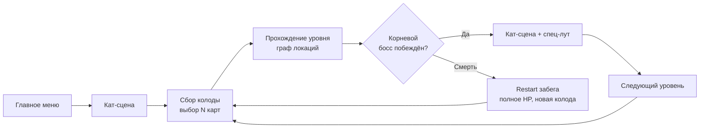
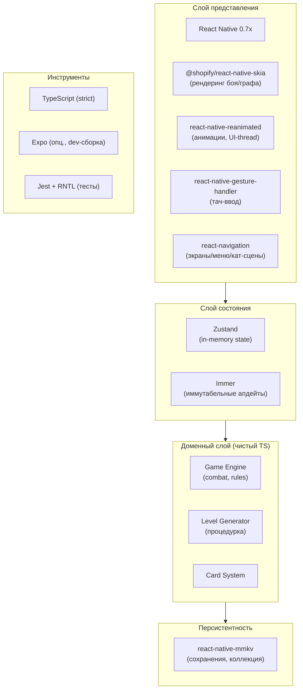

# Глава 1. Обзор, глоссарий и технический стек

> Часть [архитектурного документа](README.md) проекта **Yar** — карточного roguelike для Android (React Native + Skia).
>
> 🏠 [Оглавление](README.md) · [Глава 2 → Архитектура системы](02-architecture.md) ➡️

---

## Содержание главы

1. [Обзор проекта](#1-обзор-проекта)
2. [Глоссарий](#2-глоссарий)
3. [Технический стек](#3-технический-стек)

---

## 1. Обзор проекта

**Yar** (*yet another rogue*) — это **карточный roguelike** для Android.

### Ключевые принципы геймплея

| Аспект | Описание |
|--------|----------|
| **Структура** | Игрок проходит уровни, представленные графом локаций с монстрами, сундуками и загадками. |
| **Смерть** | При смерти забег начинается заново: полное здоровье, новая колода. Прогресс — в собранной коллекции карт. |
| **Экономика** | Денег нет. Перед уровнем игрок **выбирает N карт** в колоду из своей коллекции. |
| **Карты** | Два типа: `SingleUse` (одноразовые) и `Permanent` (перезагружаются каждый бой). |
| **Снаряжение** | Оружие и броня повышают атаку и здоровье. |
| **Прокачка** | Карты находятся в боях/сундуках, открываются в **хранилище** и доступны для следующего захода. |
| **Нарратив** | Перед уровнем и после победы над корневым боссом — текстовая кат-сцена. |

### Цикл прогрессии (high-level)

> Детализация этого цикла — в главе [«Игровые системы»](04-gameplay.md) (циклы забега и боя, user flow, карточная система).

---

## 2. Глоссарий

Термины используются единообразно во всех главах документа.

| Термин | Определение |
|--------|-------------|
| **Run (Забег)** | Одна игровая попытка от старта до смерти. |
| **Level (Уровень)** | Граф локаций (k-дольный граф) от начала к концу. |
| **Start** | Стартовая вершина уровня (вход игрока). |
| **End** | Финальная вершина уровня с боссом (корневой босс). |
| **Node (Вершина)** | Локация на уровне: бой / сундук / вопрос / босс. |
| **Layer / Partition (Доля)** | Слой k-дольного графа. Рёбра идут между соседними долями. |
| **Collection (Коллекция)** | Хранилище всех открытых игроком карт (персистентно). |
| **Run Deck (Колода забега)** | Колода, собранная перед уровнем из коллекции; фиксируется до старта. |
| **Draw Pile (Колода добора)** | Карты, из которых тянут в бою. |
| **Hand (Рука)** | Карты, доступные к розыгрышу в текущий момент. |
| **Permanent card** | После розыгрыша уходит в низ колоды добора; восстанавливается между боями. |
| **Single-use card** | После розыгрыша исчезает; живёт только в пределах уровня. |

> Структуры данных, стоящие за этими терминами, описаны в главе [«Модель данных»](03-data-model.md).

---

## 3. Технический стек

### Обоснование выбора

| Технология | Назначение | Почему |
|------------|-----------|--------|
| **React Native** | Каркас приложения | Нативный Android, без браузера/WebView. |
| **Skia** | Рендеринг боя и графа | GPU-ускорение, 60 fps, кастомное рисование без движка. |
| **Reanimated 3** | Анимации | Работа в UI-потоке, нет джанков при анимации карт. |
| **Gesture Handler** | Drag-and-drop карт, тапы по вершинам | Жесты обрабатываются нативно. |
| **Zustand + Immer** | Состояние игры | Лёгкий, без бойлерплейта; домен изолирован от React. |
| **MMKV** | Сохранения | Самое быстрое key-value хранилище для RN. |
| **TypeScript strict** | Типобезопасность | Доменная модель строго типизирована. |

> Доменный слой (правила игры, генерация, бой) — это чистый TypeScript без зависимостей от React. React/Skia — только представление. Это даёт тестируемость и переносимость логики. Подробнее о разделении слоёв — в главе [«Архитектура системы»](02-architecture.md), о тестировании домена — в главе [«Процесс разработки»](06-development.md#145-стратегия-тестирования).
>
> Лицензии всех перечисленных фреймворков приведены в [THIRD_PARTY_LICENSES.md](../../THIRD_PARTY_LICENSES.md).

---

> 🏠 [Оглавление](README.md) · [Глава 2 → Архитектура системы](02-architecture.md) ➡️
