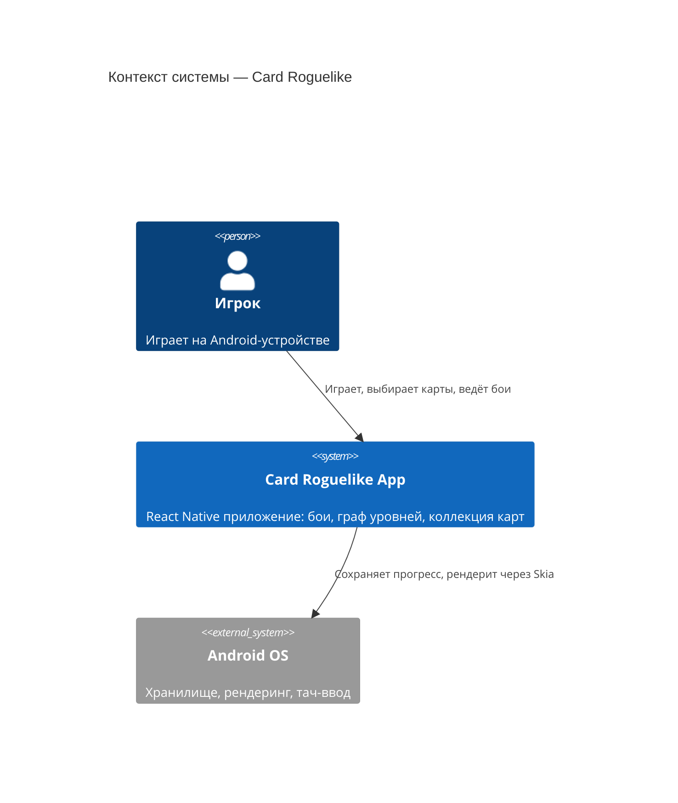
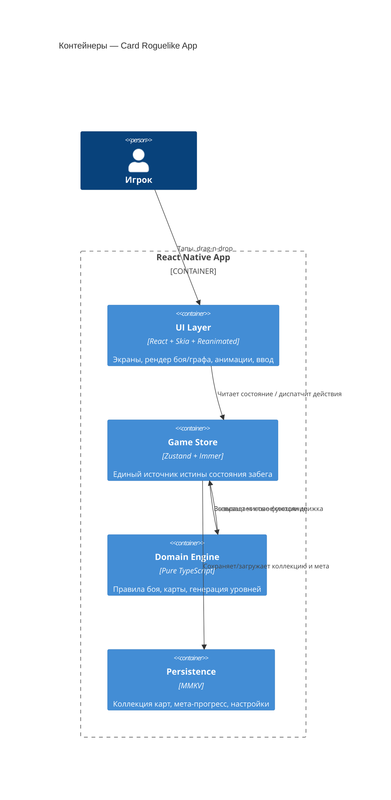
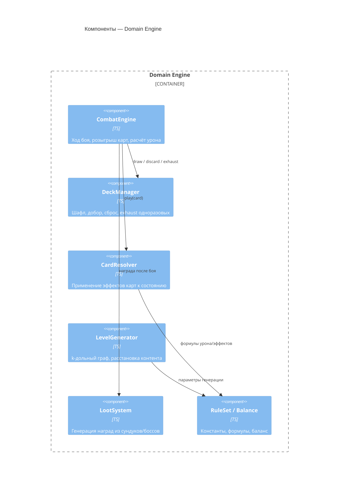
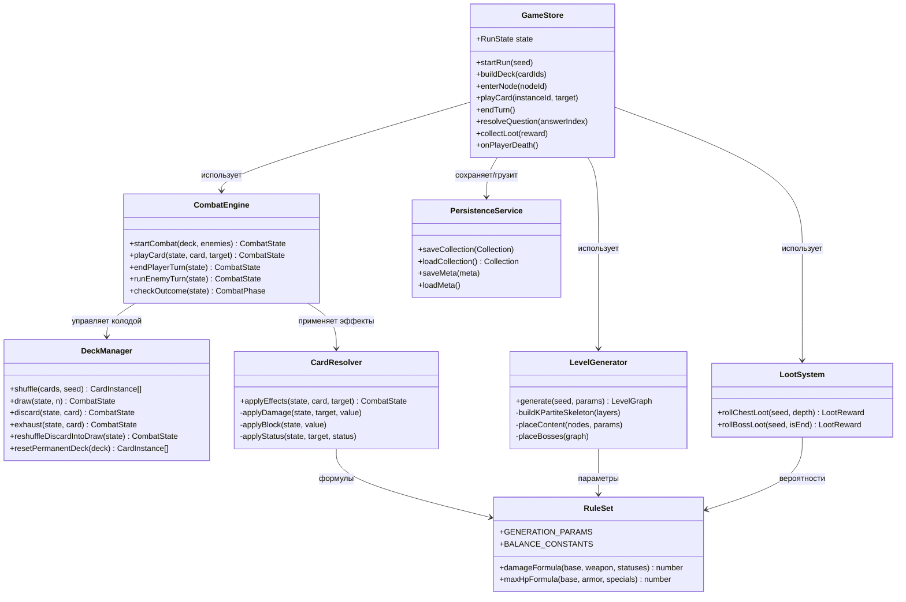
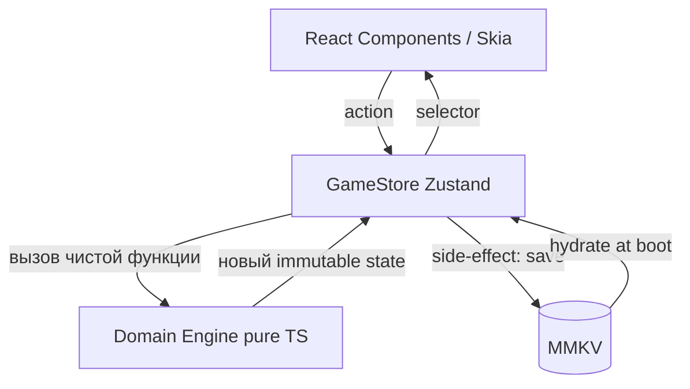

# Глава 2. Архитектура системы

> Часть [архитектурного документа](README.md) проекта **Yar**.
>
> ⬅️ [Глава 1 ← Обзор](01-overview.md) · 🏠 [Оглавление](README.md) · [Глава 3 → Модель данных](03-data-model.md) ➡️

---

## Содержание главы

4. [Архитектура системы (C4)](#4-архитектура-системы-c4)
5. [Архитектура классов](#5-архитектура-классов)
6. [Управление состоянием](#6-управление-состоянием)

Эта глава описывает **структуру** приложения: слои C4, доменные сервисы и поток данных стора. Структуры данных, которыми они оперируют, вынесены в главу [«Модель данных»](03-data-model.md).

---

## 4. Архитектура системы (C4)

### 4.1. Контекст

### 4.2. Контейнеры

Поток «UI → Store → Domain → Store → UI» детализирован как однонаправленный data flow в разделе [6. Управление состоянием](#6-управление-состоянием).

### 4.3. Компоненты доменного движка

Поведение этих компонентов раскрыто в главах [«Игровые системы»](04-gameplay.md) (карточная система) и [«Генерация и бой»](05-generation-combat.md) (LevelGenerator, CombatEngine, RuleSet).

---

## 5. Архитектура классов

Доменный движок построен на чистых сервисах и иммутабельных reducer-функциях. React-компоненты лишь подписаны на стор.

### Разделение ответственности

| Класс/Сервис | Чистый? | Ответственность |
|--------------|---------|-----------------|
| `GameStore` | Нет (Zustand) | Оркестрация, единый источник истины, диспатч действий. |
| `CombatEngine` | Да | Полный цикл боя, переходы фаз. См. [§12](05-generation-combat.md#12-боевая-система). |
| `DeckManager` | Да | Жизненный цикл карт: шафл/добор/сброс/exhaust. См. [§10](04-gameplay.md#10-карточная-система). |
| `CardResolver` | Да | Применение эффектов карт к состоянию. |
| `LevelGenerator` | Да | Построение k-дольного графа и контента. См. [§11](05-generation-combat.md#11-процедурная-генерация-уровня). |
| `LootSystem` | Да | Генерация наград. |
| `RuleSet` | Да | Константы баланса и формулы (единая точка тюнинга). |
| `PersistenceService` | Нет (I/O) | Сохранение/загрузка через MMKV. |

> Все чистые сервисы детерминированы относительно `seed` — это критично для воспроизводимости забега и тестирования (см. [нефункциональные требования](06-development.md#131-нефункциональные-требования)). Структуры `RunState`, `CombatState`, `LevelGraph`, которыми оперируют эти сервисы, описаны в главе [«Модель данных»](03-data-model.md).

---

## 6. Управление состоянием

### 6.1. Принцип

Однонаправленный поток данных: UI диспатчит действия в стор, стор вызывает чистые функции домена, получает новое иммутабельное состояние и отдаёт его обратно в UI через селекторы.

### 6.2. Структура стора (Zustand-срезы)

| Срез | Содержит | Персистентность |
|------|----------|-----------------|
| `runSlice` | [`RunState`](03-data-model.md#77-состояние-забега) — текущий забег | Только in-memory (теряется при смерти). |
| `combatSlice` | [`CombatState`](03-data-model.md#75-враги-и-бой) — активный бой | In-memory. |
| `metaSlice` | [`Collection`](03-data-model.md#73-коллекция-и-колода-мета-уровень), прогресс, разблокировки | **Персистентно (MMKV)**. |
| `settingsSlice` | Звук, язык, сложность | **Персистентно (MMKV)**. |

> Разделение на срезы — основная мера против раздувания `GameStore` (см. [архитектурные риски](06-development.md#132-архитектурные-риски)). Только `metaSlice` и `settingsSlice` переживают смерть забега; `runSlice`/`combatSlice` намеренно эфемерны.

---

> ⬅️ [Глава 1 ← Обзор](01-overview.md) · 🏠 [Оглавление](README.md) · [Глава 3 → Модель данных](03-data-model.md) ➡️
