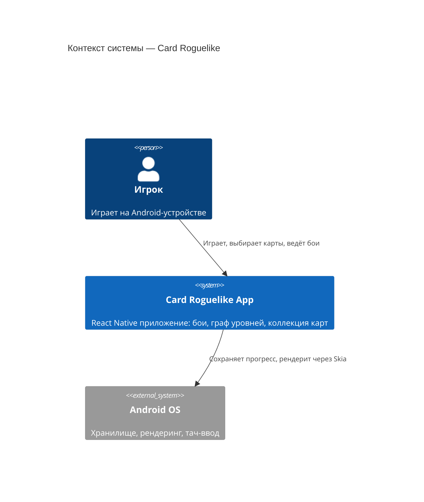
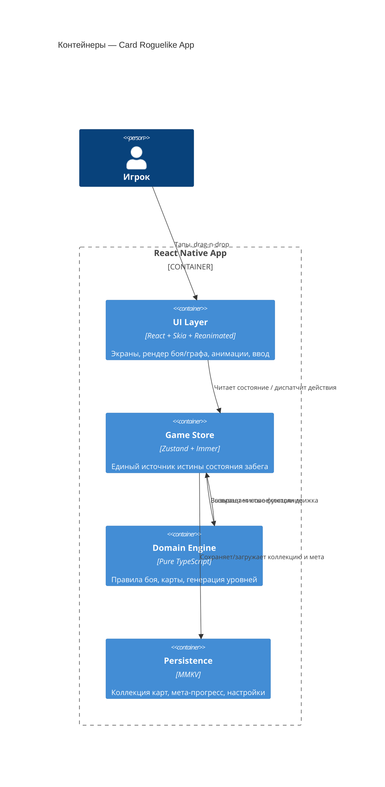
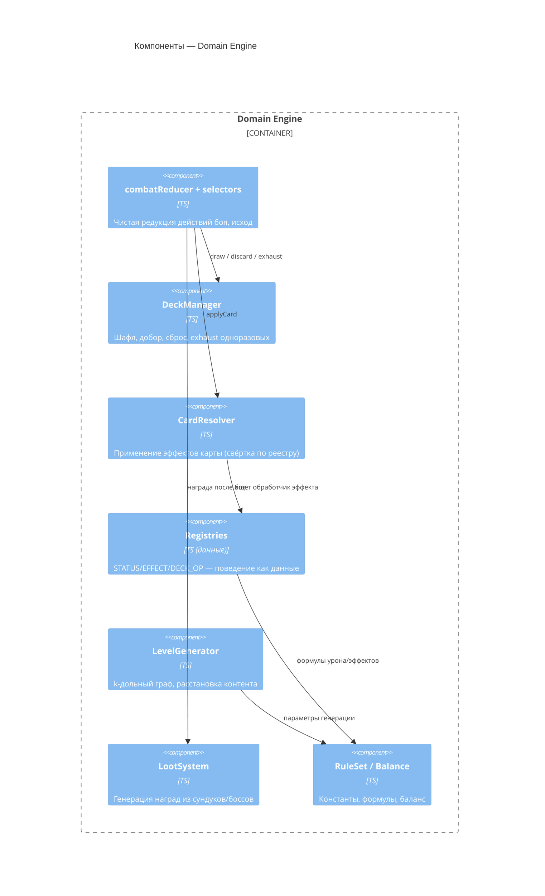
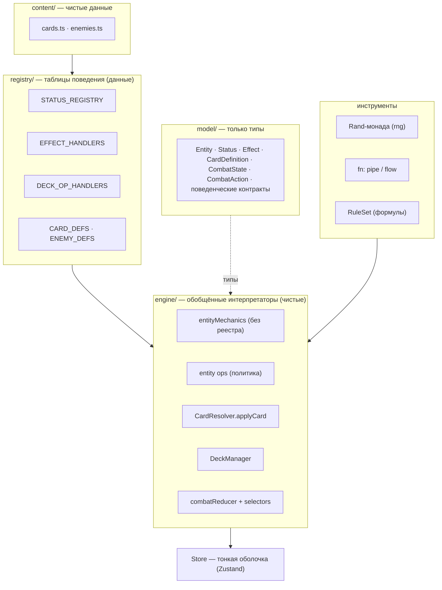
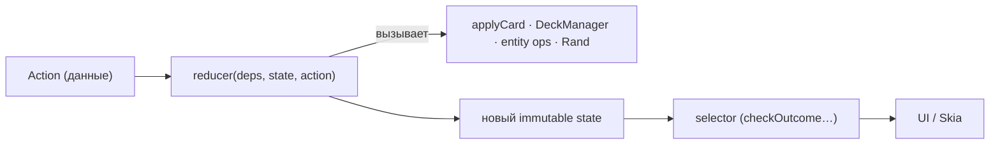
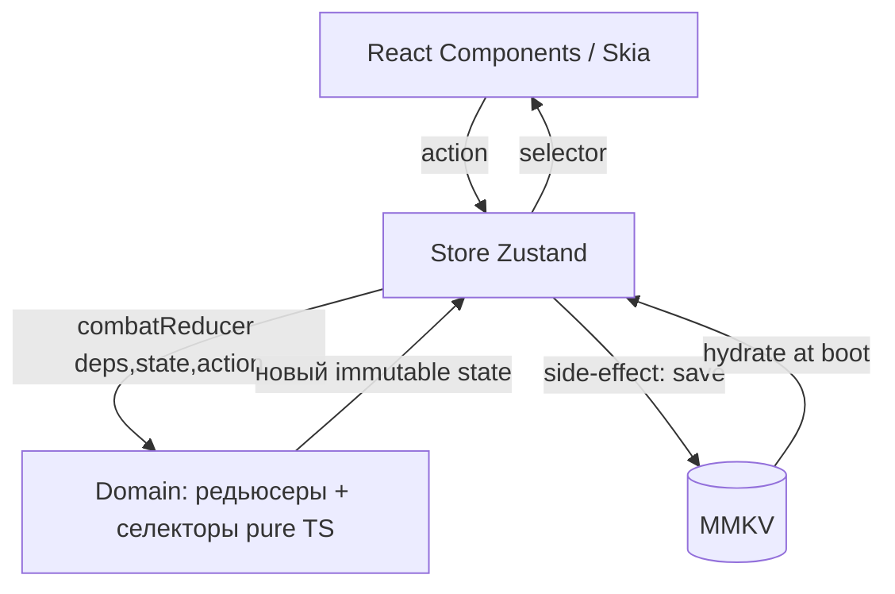

# Глава 2. Архитектура системы

> Часть [архитектурного документа](README.md) проекта **Yar**.
>
> ⬅️ [Глава 1 ← Обзор](01-overview.md) · 🏠 [Оглавление](README.md) · [Глава 3 → Модель данных](03-data-model.md) ➡️

---

## Содержание главы

4. [Архитектура системы (C4)](#4-архитектура-системы-c4)
5. [Архитектура домена](#5-архитектура-домена)
6. [Управление состоянием](#6-управление-состоянием)

Эта глава описывает **структуру** приложения: слои C4, доменные сервисы и поток данных стора. Структуры данных, которыми они оперируют, вынесены в главу [«Модель данных»](03-data-model.md).

---

## 4. Архитектура системы (C4)

### 4.1. Контекст

### 4.2. Контейнеры

Поток «UI → Store → Domain → Store → UI» детализирован как однонаправленный data flow в разделе [6. Управление состоянием](#6-управление-состоянием).

### 4.3. Компоненты доменного движка

Поведение этих компонентов раскрыто в главах [«Игровые системы»](04-gameplay.md) (карточная система) и [«Генерация и бой»](05-generation-combat.md) (combatReducer, RuleSet).

---

## 5. Архитектура домена

Доменный слой — **чистое функциональное ядро с data-driven диспетчеризацией**. Поведение статусов, эффектов, дека-операций, карт и врагов задаётся **данными в реестрах**, а движок — это набор обобщённых интерпретаторов (редьюсеры, селекторы, op-ы сущностей), которые эти данные исполняют. Поэтому добавить статус/эффект/карту/врага = добавить запись в реестр или контент, не трогая движок (открыт для расширения, закрыт для изменения — проверяется компилятором через `satisfies Record<…>`). Случайность течёт через монаду `Rand` (детерминизм по `seed`), а композиция op-ов — через комбинаторы `pipe`/`flow`.

### 5.1. Слои

Граф зависимостей ацикличен: `entityMechanics` не знает о реестрах; реестры зовут только механику; политика (`entity ops`, резолвер) читает реестры, но реестры её не импортируют.

### 5.2. Поток данных (action → reducer → selector)

Однонаправленный поток «UI → Store → Domain → Store → UI» сохраняется (см. [§6](#6-управление-состоянием)); меняется лишь природа «Domain» — это **редьюсеры и селекторы**, а не сервис-классы. Реализация боя — `combatReducer` поверх `applyCard`, `DeckManager` и op-ов сущностей; правила боя — в [§12](05-generation-combat.md#12-боевая-система).

### Разделение ответственности

| Модуль | Чистый? | Ответственность |
|--------|---------|-----------------|
| `Store` | Нет (Zustand) | Тонкая оболочка: связывает `deps`, диспатчит действия в редьюсеры, отдаёт селекторы. |
| `combatReducer` | Да | Чистая редукция действий боя (`StartCombat`/`PlayCard`/`EndTurn`). См. [§12](05-generation-combat.md#12-боевая-система). |
| `selectors` (`checkOutcome`) | Да | Производное состояние (исход боя); переходы фаз — только в редьюсерах. |
| Реестры (`STATUS_`/`EFFECT_`/`DECK_OP_`) | Да (данные) | Поведение статусов/эффектов/деки как данные — точка расширения. |
| `CardResolver` | Да | Применение эффектов карты (обобщённая свёртка по реестру эффектов). |
| `DeckManager` | Да | Жизненный цикл карт: шафл/добор/сброс/exhaust. См. [§10](04-gameplay.md#10-карточная-система). |
| entity ops + `entityMechanics` | Да | Стат-операции сущностей (урон/блок/статусы), data-driven по `STATUS_REGISTRY`. |
| `Rand` | Да | Детерминированная случайность (seeded-State монада). |
| `RuleSet` | Да | Константы баланса и формулы (единая точка тюнинга). |
| `LevelGenerator` | Да | Построение k-дольного графа и контента. См. [§11](05-generation-combat.md#11-процедурная-генерация-уровня). |
| `LootSystem` | Да | Генерация наград. |
| `PersistenceService` | Нет (I/O) | Сохранение/загрузка через MMKV. |

> Все чистые модули детерминированы относительно `seed` — это критично для воспроизводимости забега и тестирования (см. [нефункциональные требования](06-development.md#131-нефункциональные-требования)). Структуры `RunState`, `CombatState`, `LevelGraph` описаны в главе [«Модель данных»](03-data-model.md).

---

## 6. Управление состоянием

### 6.1. Принцип

Однонаправленный поток данных: UI диспатчит действия в стор, стор вызывает **редьюсеры домена** (`set(s => combatReducer(deps, s, action))`), получает новое иммутабельное состояние и отдаёт его обратно в UI через селекторы. Логика — в редьюсерах; стор лишь диспатчит и читает производное.

### 6.2. Структура стора (Zustand-срезы)

| Срез | Содержит | Персистентность |
|------|----------|-----------------|
| `runSlice` | [`RunState`](03-data-model.md#77-состояние-забега) — текущий забег | Только in-memory (теряется при смерти). |
| `combatSlice` | [`CombatState`](03-data-model.md#75-враги-и-бой) — активный бой | In-memory. |
| `metaSlice` | [`Collection`](03-data-model.md#73-коллекция-и-колода-мета-уровень), прогресс, разблокировки | **Персистентно (MMKV)**. |
| `settingsSlice` | Звук, язык, сложность | **Персистентно (MMKV)**. |

> Разделение на срезы — основная мера против раздувания `GameStore` (см. [архитектурные риски](06-development.md#132-архитектурные-риски)). Только `metaSlice` и `settingsSlice` переживают смерть забега; `runSlice`/`combatSlice` намеренно эфемерны.

---

> ⬅️ [Глава 1 ← Обзор](01-overview.md) · 🏠 [Оглавление](README.md) · [Глава 3 → Модель данных](03-data-model.md) ➡️
