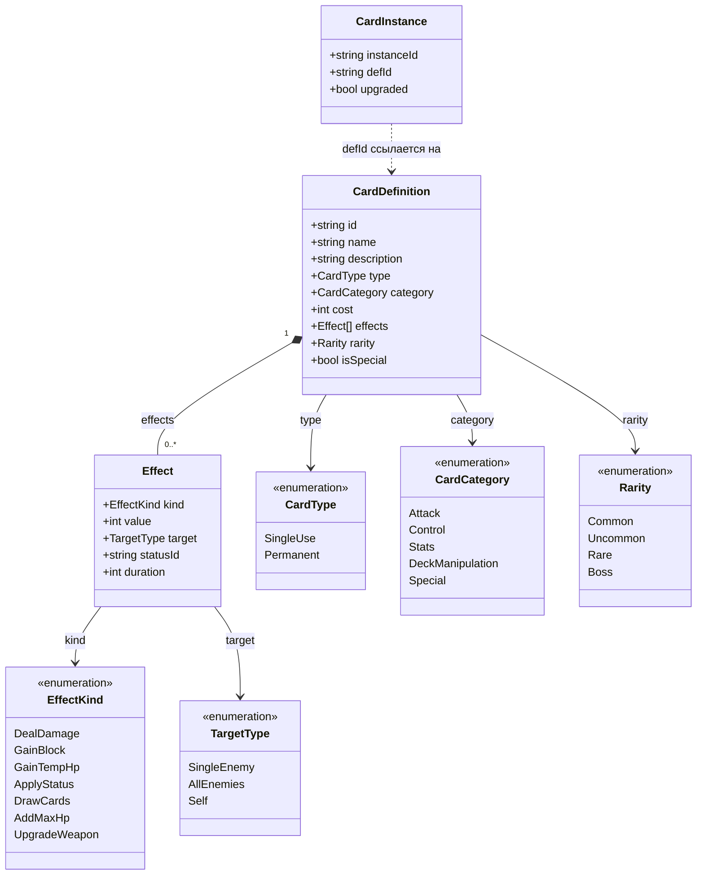
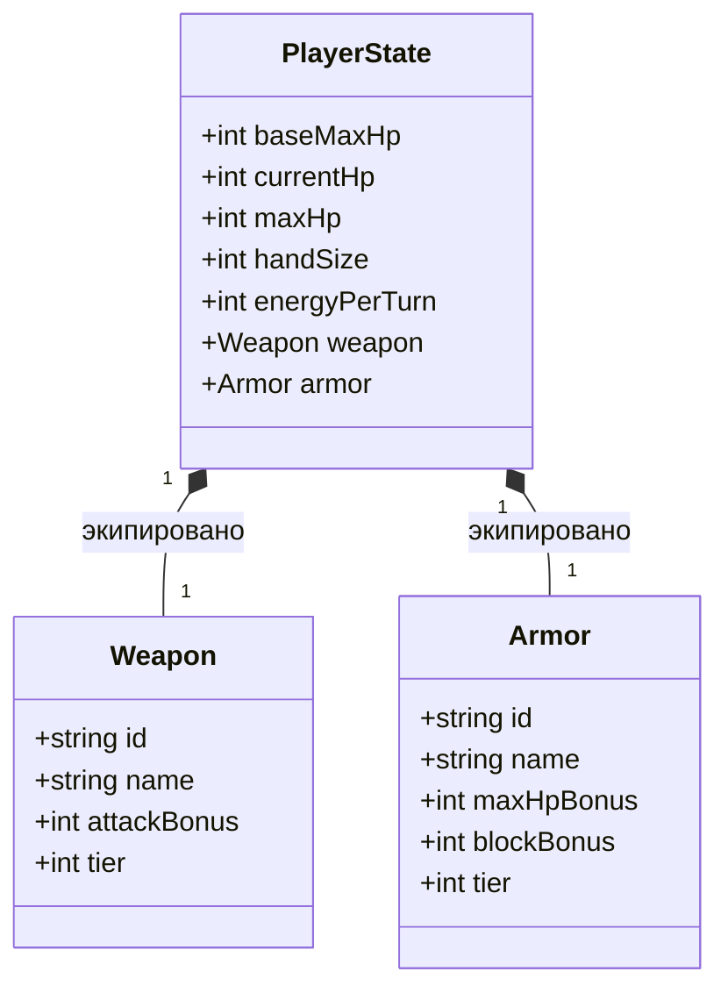
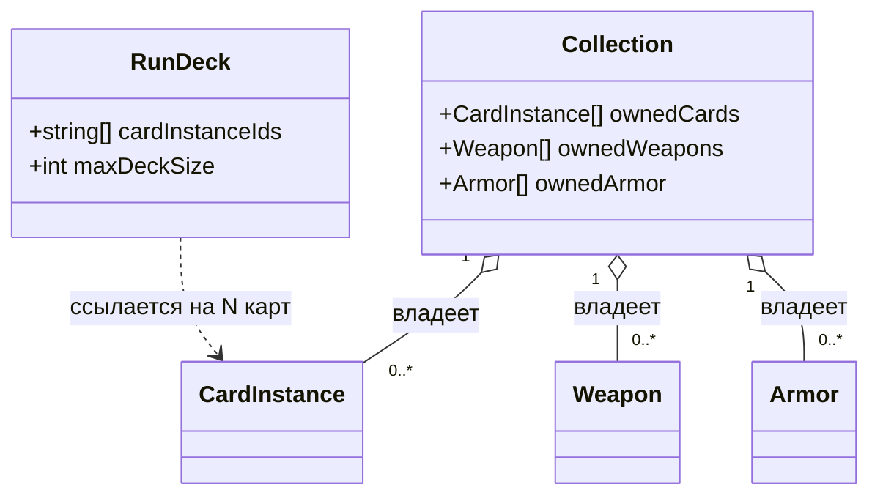
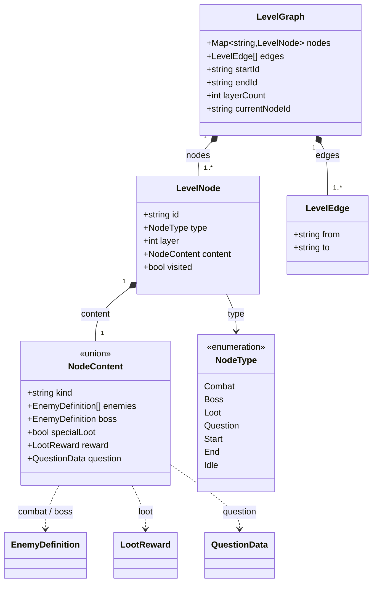
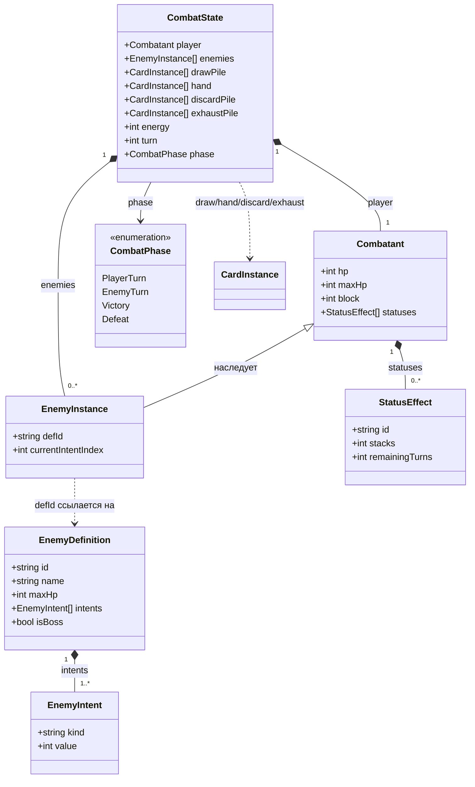
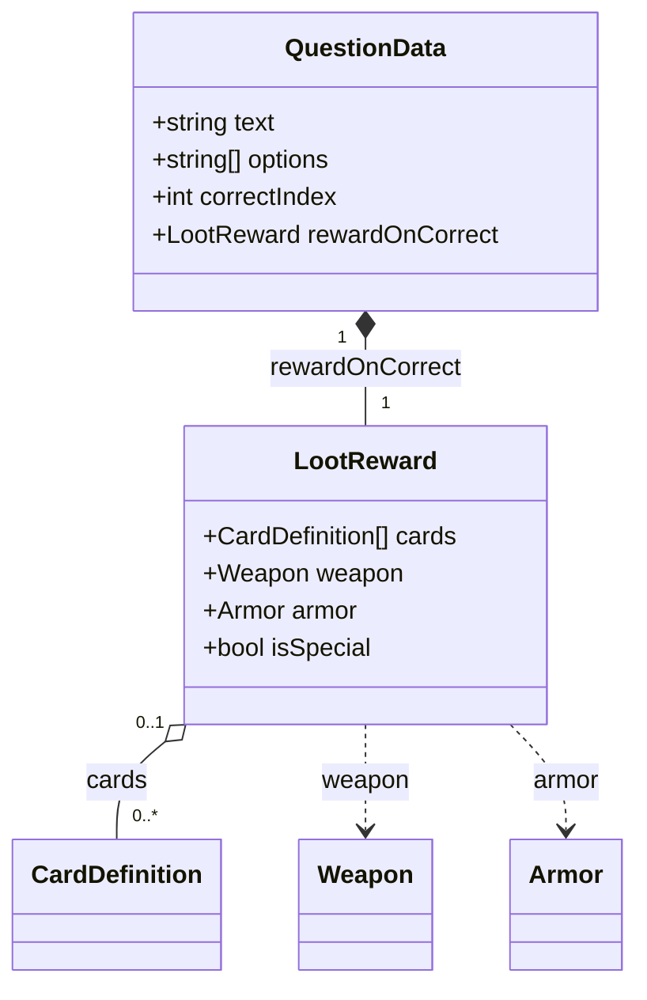
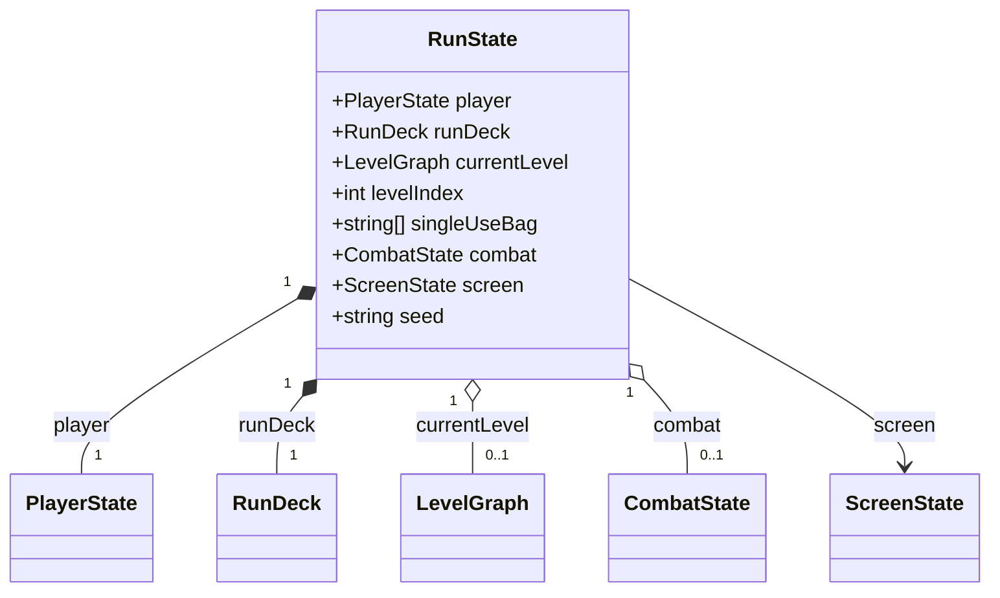
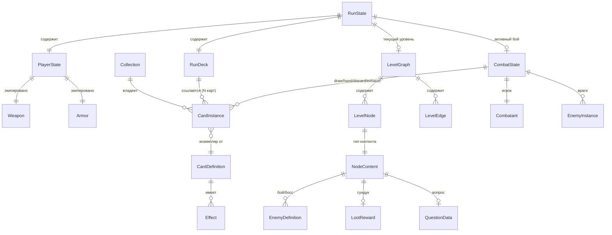

# Глава 3. Модель данных

> Часть [архитектурного документа](README.md) проекта **Yar**.
>
> ⬅️ [Глава 2 ← Архитектура системы](02-architecture.md) · 🏠 [Оглавление](README.md) · [Глава 4 → Игровые системы](04-gameplay.md) ➡️

---

## 7. Модель данных

Доменная модель строго типизирована (TypeScript strict). Все агрегаты ниже — это данные, которыми оперируют чистые сервисы из главы [«Архитектура системы»](02-architecture.md#5-архитектура-классов). Обзорная схема связей собрана в [§7.8](#78-сводная-диаграмма-связей-доменной-модели).

### Содержание главы

- [7.1. Карты](#71-карты)
- [7.2. Игрок и снаряжение](#72-игрок-и-снаряжение)
- [7.3. Коллекция и колода (мета-уровень)](#73-коллекция-и-колода-мета-уровень)
- [7.4. Граф уровня (k-дольный)](#74-граф-уровня-k-дольный)
- [7.5. Враги и бой](#75-враги-и-бой)
- [7.6. Лут и вопросы](#76-лут-и-вопросы)
- [7.7. Состояние забега](#77-состояние-забега)
- [7.8. Сводная диаграмма связей доменной модели](#78-сводная-диаграмма-связей-доменной-модели)

---

### 7.1. Карты

Примечания:
- `CardType` определяет жизненный цикл: `SingleUse` исчезает после розыгрыша (живёт в пределах уровня), `Permanent` уходит в низ колоды и восстанавливается между боями. Полный жизненный цикл — в [§10.1](04-gameplay.md#101-жизненный-цикл-карты-внутри-одного-боя).
- `CardInstance` — забегтайм-экземпляр, ссылается на `CardDefinition` (instance ≠ definition).
- Урон/блок/статусы вычисляются из `Effect.value` для соответствующего `EffectKind` (`DealDamage`, `GainBlock`, `ApplyStatus`, …) — см. [формулы боя §12.2](05-generation-combat.md#122-формулы-единая-точка-в-ruleset).
- `isSpecial` / `Rarity.Boss` — карты, выпадающие только после корневого босса (end).

### 7.2. Игрок и снаряжение

Примечания:
- `maxHp` = `baseMaxHp` + бонусы брони + спец-карты («+сердце»).
- `Weapon.attackBonus` прибавляется к урону атакующих карт; `Armor.maxHpBonus`/`blockBonus` — к HP и пассивному блоку. Точные формулы — в [§12.2](05-generation-combat.md#122-формулы-единая-точка-в-ruleset).

### 7.3. Коллекция и колода (мета-уровень)

Примечания:
- `Collection` — персистентное хранилище всего, что игрок открыл (срез `metaSlice`, см. [§6.2](02-architecture.md#62-структура-стора-zustand-срезы)).
- `RunDeck` — выбранные N карт перед уровнем; фиксируется до старта (`maxDeckSize` = ограничение N). Откуда берутся новые карты — в [§10.2](04-gameplay.md#102-откуда-берутся-карты).

### 7.4. Граф уровня (k-дольный)

Примечания:
- `LevelGraph` — **ориентированный ациклический граф (DAG)**, разбитый на `layerCount` слоёв-долей (k-дольный): один `startId`, один `endId`, рёбра идут только «вперёд», между соседними долями. Класс графа и его свойства — в [§11](05-generation-combat.md#11-процедурная-генерация-уровня).
- `NodeContent` — размеченное объединение (discriminated union по полю `kind`): `combat` / `boss` / `loot` / `question`.
- `Start`, `End` и `Idle` — структурные вершины без интерактивного контента: `Start` — вход игрока, `End` — корневой босс (контент `boss` + `specialLoot`), `Idle` — пустая/проходная вершина (резерв под отдых/событие).
- `LevelEdge` направлено: `from` ближе к start, `to` ближе к end. Алгоритм построения — в [§11](05-generation-combat.md#11-процедурная-генерация-уровня).

### 7.5. Враги и бой

Примечания:
- `block` (временный щит) сбрасывается каждый ход.
- `drawPile` — перемешанная колода добора; `discardPile` — сброс permanent-карт; `exhaustPile` — отыгранные single-use (визуально). Переходы между стопками — в [§10.1](04-gameplay.md#101-жизненный-цикл-карты-внутри-одного-боя).
- `EnemyInstance` расширяет `Combatant` и хранит ссылку на `EnemyDefinition` + текущий intent. Поведение по `intents` — в [§12.3](05-generation-combat.md#123-поведение-врагов).

### 7.6. Лут и вопросы

Примечания:
- `isSpecial` помечает спец-лут после end-босса.
- При неверном ответе на вопрос — пусто (empty): без штрафа и без награды (см. [user flow §9](04-gameplay.md#9-user-flow)).

### 7.7. Состояние забега

Примечания:
- `currentLevel` и `combat` опциональны (`null`, когда уровень/бой не активны).
- `singleUseBag` — id одноразовых карт, имеющихся на текущем уровне (отдельный цикл жизни).
- `seed` — детерминированный сид процедурной генерации забега. Детерминизм по `seed` — нефункциональное требование, см. [§13.1](06-development.md#131-нефункциональные-требования).
- `RunState` живёт в срезе `runSlice` и теряется при смерти забега (см. [§6.2](02-architecture.md#62-структура-стора-zustand-срезы)).

### 7.8. Сводная диаграмма связей доменной модели

Обзорная ER-диаграмма, связывающая все агрегаты модели воедино (детали полей — в диаграммах классов [7.1](#71-карты)–[7.7](#77-состояние-забега) выше).

---

> ⬅️ [Глава 2 ← Архитектура системы](02-architecture.md) · 🏠 [Оглавление](README.md) · [Глава 4 → Игровые системы](04-gameplay.md) ➡️
