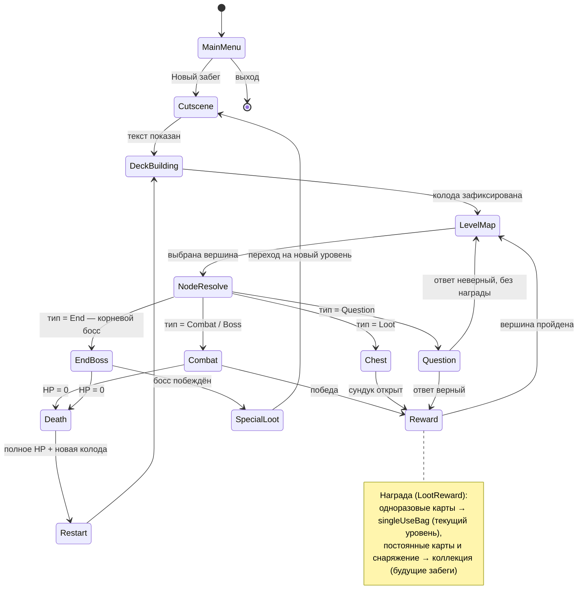
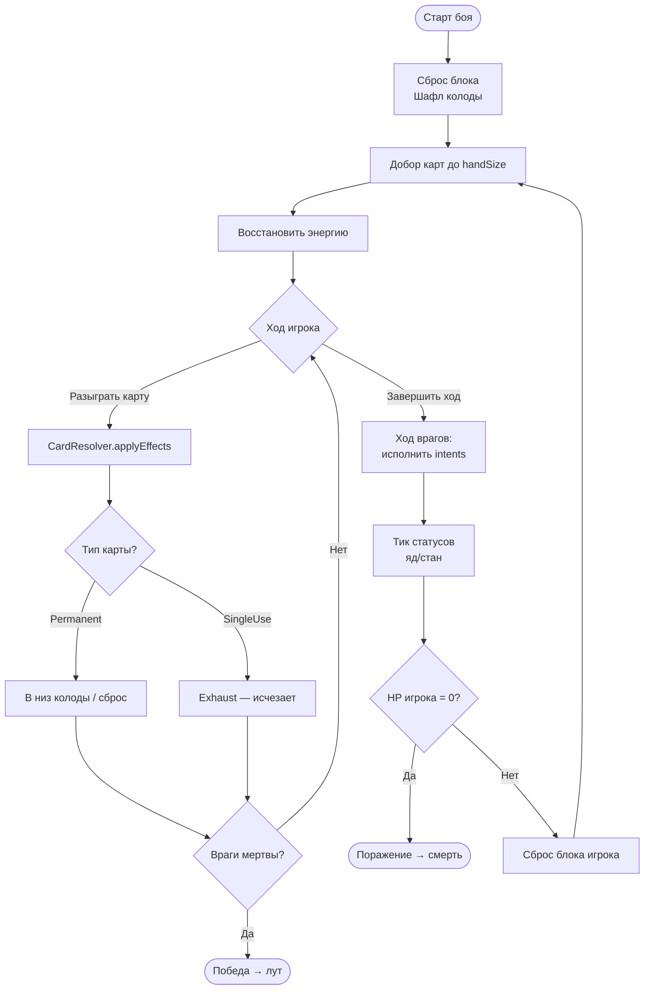
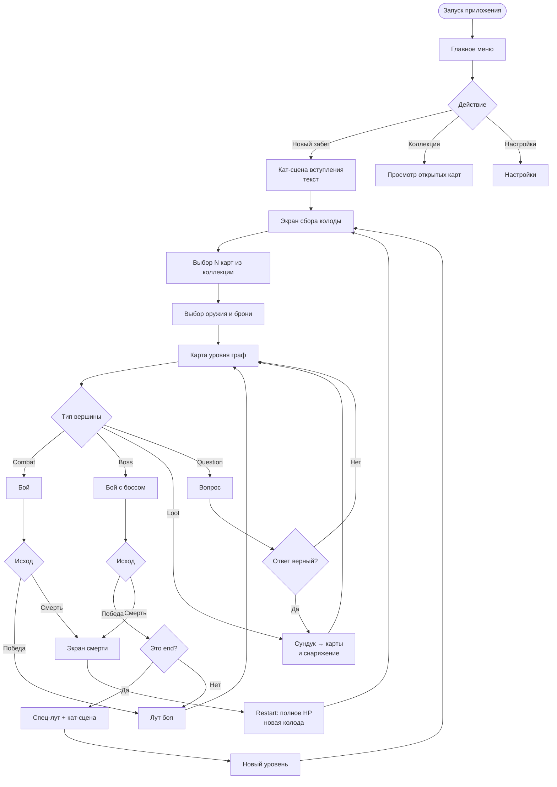
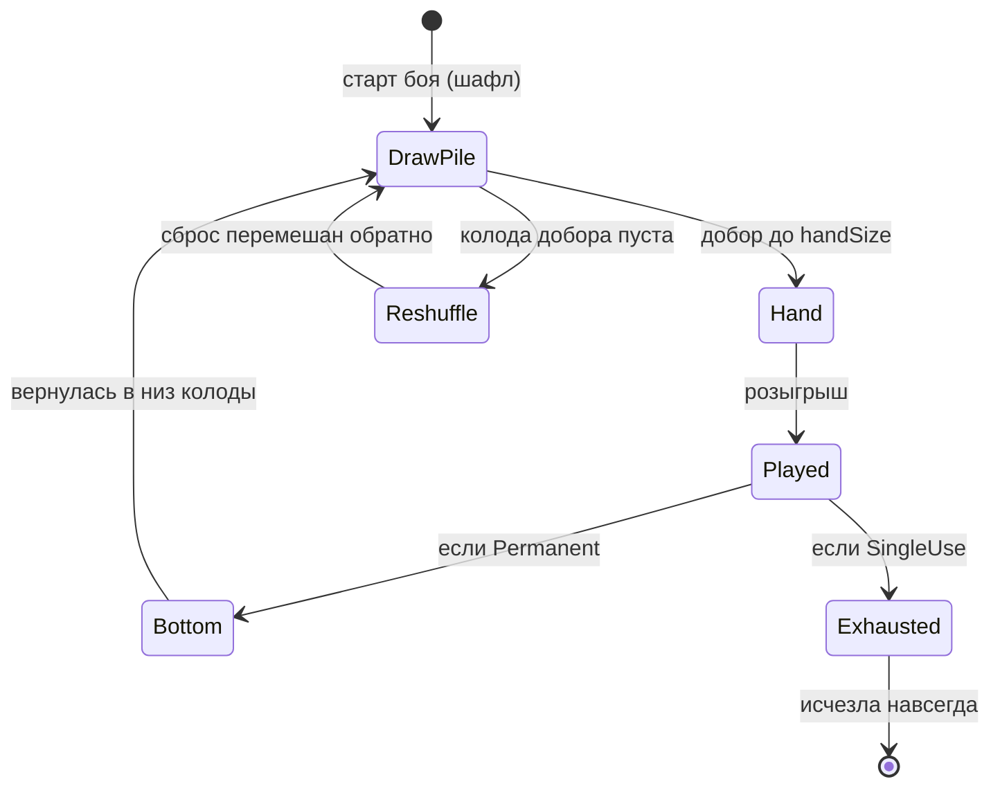
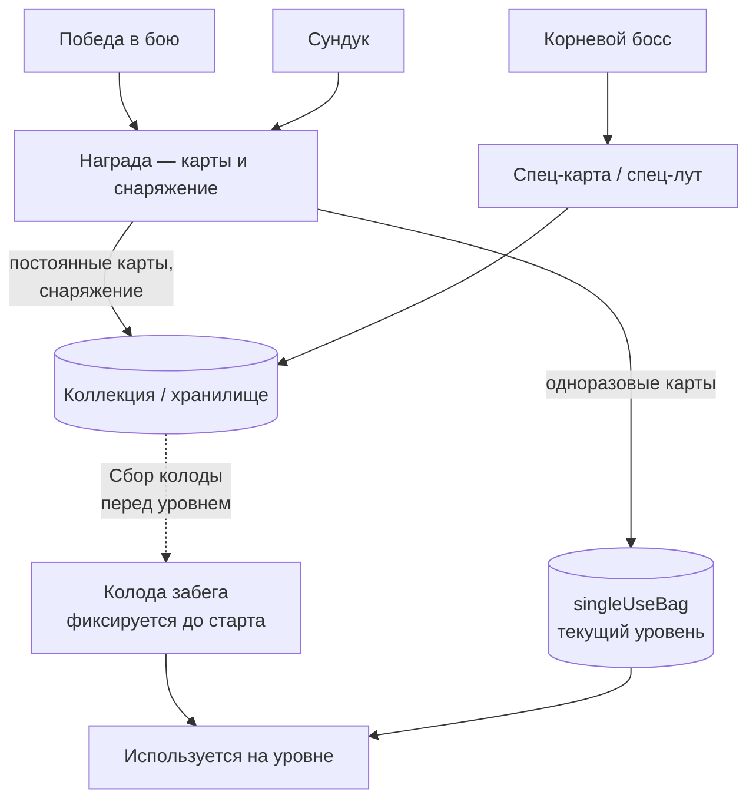

# Глава 4. Игровые системы

> Часть [архитектурного документа](README.md) проекта **Yar**.
>
> ⬅️ [Глава 3 ← Модель данных](03-data-model.md) · 🏠 [Оглавление](README.md) · [Глава 5 → Генерация и бой](05-generation-combat.md) ➡️

---

## Содержание главы

8. [Игровые циклы (Main Loops)](#8-игровые-циклы-main-loops)
9. [User Flow](#9-user-flow)
10. [Карточная система](#10-карточная-система)

Эта глава описывает геймплей с точки зрения игрока: циклы забега и боя, навигацию по экранам и систему карт. Алгоритмическая «начинка» (генерация уровня, формулы боя) вынесена в главу [«Генерация и бой»](05-generation-combat.md).

---

## 8. Игровые циклы (Main Loops)

### 8.1. Цикл забега (Run Loop)

### 8.2. Главный цикл боя (Combat Loop)

> Реализация этого цикла — `CombatEngine` + `DeckManager` + `CardResolver` (см. [архитектуру классов §5](02-architecture.md#5-архитектура-классов)). Пошаговая последовательность взаимодействий — в [§12.1](05-generation-combat.md#121-структура-хода).

---

## 9. User Flow

### Описание ключевых экранов

| Экран | Назначение | Технология рендера |
|-------|-----------|--------------------|
| **Главное меню** | Старт, коллекция, настройки | React Native UI |
| **Кат-сцена** | Текстовый нарратив (typewriter) | RN + Reanimated |
| **Сбор колоды** | Выбор N карт, оружия, брони | RN UI + жесты |
| **Карта уровня** | Граф локаций, навигация | **Skia** (узлы/рёбра) + жесты |
| **Бой** | Карты, рука, враги, анимации | **Skia** + Reanimated + Gesture Handler |
| **Сундук / Вопрос** | Награда / квиз | RN UI |
| **Экран смерти** | Итоги, рестарт | RN UI |

---

## 10. Карточная система

Самая важная подсистема. Точно отражает уточнённые правила жизненного цикла карт. Структуры данных карты — в [§7.1](03-data-model.md#71-карты).

### 10.1. Жизненный цикл карты (внутри одного боя)

### 10.2. Откуда берутся карты

> **Постоянные** карты не попадают в текущую колоду: они открываются в коллекции и доступны для сборки колоды перед **следующим** заходом. Основная колода забега (`RunDeck`) фиксируется до старта и постоянными картами в процессе не пополняется. Исключение — **одноразовые** карты, найденные в забеге: они складываются в запас текущего уровня (`singleUseBag`, отдельный цикл жизни, см. [§7.7](03-data-model.md#77-состояние-забега)) и могут быть разыграны до конца уровня. **Снаряжение** уходит в коллекцию для будущих забегов. Источник наград — `LootSystem` (см. [§5](02-architecture.md#5-архитектура-классов)).

### 10.3. Категории карт (примеры)

| Категория | Примеры | Тип |
|-----------|---------|-----|
| **Attack** | Удар, Веерный удар (по всем), Тяжёлый удар | Обычно Permanent |
| **Control** | Заморозка, Стан, Слабость | Permanent/SingleUse |
| **Stats** | Щит, Временное HP | Permanent |
| **DeckManipulation** | Добор +2, Перемешать, Найти карту | Permanent |
| **Special** | +Сердце (max HP), Улучшить оружие | Обычно SingleUse |

> Категории соответствуют перечислению `CardCategory`, а конкретные эффекты — `EffectKind` из [модели карт §7.1](03-data-model.md#71-карты).

---

> ⬅️ [Глава 3 ← Модель данных](03-data-model.md) · 🏠 [Оглавление](README.md) · [Глава 5 → Генерация и бой](05-generation-combat.md) ➡️
