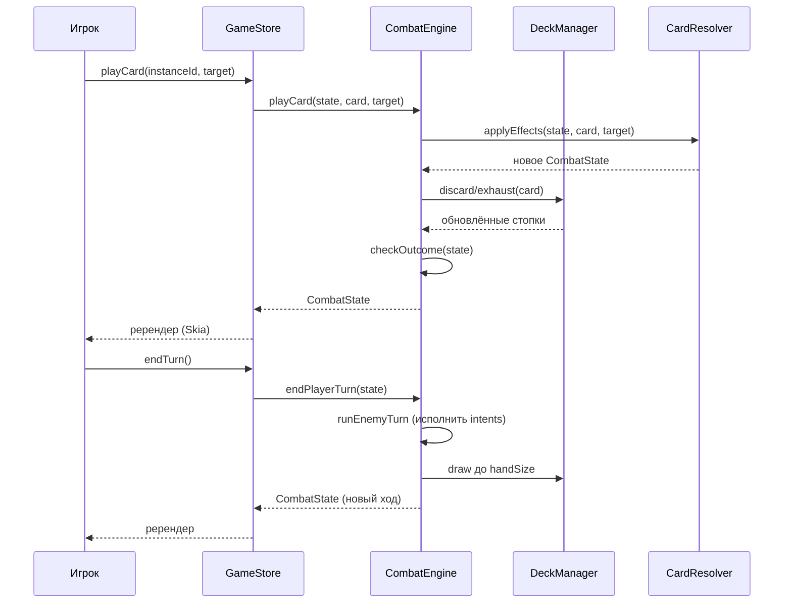

# Глава 5. Генерация уровня и боевая система

> Часть [архитектурного документа](README.md) проекта **Yar**.
>
> ⬅️ [Глава 4 ← Игровые системы](04-gameplay.md) · 🏠 [Оглавление](README.md) · [Глава 6 → Процесс разработки](06-development.md) ➡️

---

## Содержание главы

11. [Процедурная генерация уровня](#11-процедурная-генерация-уровня)
12. [Боевая система](#12-боевая-система)

Две ключевые алгоритмические подсистемы. Обе детерминированы по `seed` и реализованы как чистый TypeScript (`LevelGenerator`, `CombatEngine` — см. [архитектуру классов §5](02-architecture.md#5-архитектура-классов)). Структуры данных — в главе [«Модель данных»](03-data-model.md).

---

## 11. Процедурная генерация уровня

Уровень — это **k-дольный (k-partite) граф**: один start, один end (корень/босс), рёбра идут от истока к корню между соседними долями. Структура графа — в [§7.4](03-data-model.md#74-граф-уровня-k-дольный).

### 11.1. Алгоритм генерации


### 11.2. Параметры генерации (в `RuleSet`)

```typescript
export interface GenerationParams {
  readonly layerCount: { min: number; max: number };  // число долей k
  readonly layerWidth: { min: number; max: number };  // вершин в доле
  readonly nodeWeights: {                              // распределение типов
    readonly combat: number;
    readonly loot: number;
    readonly question: number;
  };
  readonly midBossCount: { min: number; max: number }; // 1-2 промежуточных
  readonly edgeDensity: number;                        // плотность рёбер 0..1
  readonly difficultyScaling: number;                  // рост сложности к end
}
```

> Генератор **детерминирован** по `seed`. Один и тот же сид → один и тот же уровень. Это упрощает отладку, тесты (см. [§14.5](06-development.md#145-стратегия-тестирования)) и потенциальные «daily challenge». Связность графа гарантируется валидатором с регенерацией при провале (см. [риски §13.2](06-development.md#132-архитектурные-риски)).

---

## 12. Боевая система

Полный игровой цикл боя описан в [§8.2](04-gameplay.md#82-главный-цикл-боя-combat-loop); здесь — последовательность взаимодействий сервисов и формулы.

### 12.1. Структура хода



### 12.2. Формулы (единая точка в `RuleSet`)

Урон, блок и временное HP берутся из `Effect.value` соответствующего `EffectKind` карты (см. [§7.1](03-data-model.md#71-карты)), а не из отдельного поля.

```typescript
// Урон атакующей карты (effect.kind == DealDamage)
damage = effect.value                       // базовое значение эффекта
       + weapon.attackBonus
       + statusModifiers(player.statuses)    // напр. усиление
       - target.block;                       // блок поглощает урон

// Максимальное HP игрока
maxHp = player.baseMaxHp
      + armor.maxHpBonus
      + specialCardsBonus;                   // карты «+сердце»

// Эффективный блок врага сбрасывается в начале его хода
```

### 12.3. Поведение врагов

Враги действуют по предопределённому паттерну `intents` (см. [`EnemyDefinition` §7.5](03-data-model.md#75-враги-и-бой)), который игрок видит заранее — это снижает RNG-фрустрацию и делает бой тактическим. Текущее намерение врага хранится в `EnemyInstance.currentIntentIndex` и циклически продвигается каждый ход врага.

---

> ⬅️ [Глава 4 ← Игровые системы](04-gameplay.md) · 🏠 [Оглавление](README.md) · [Глава 6 → Процесс разработки](06-development.md) ➡️
