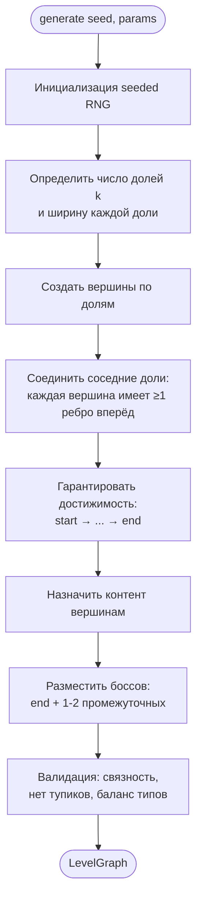
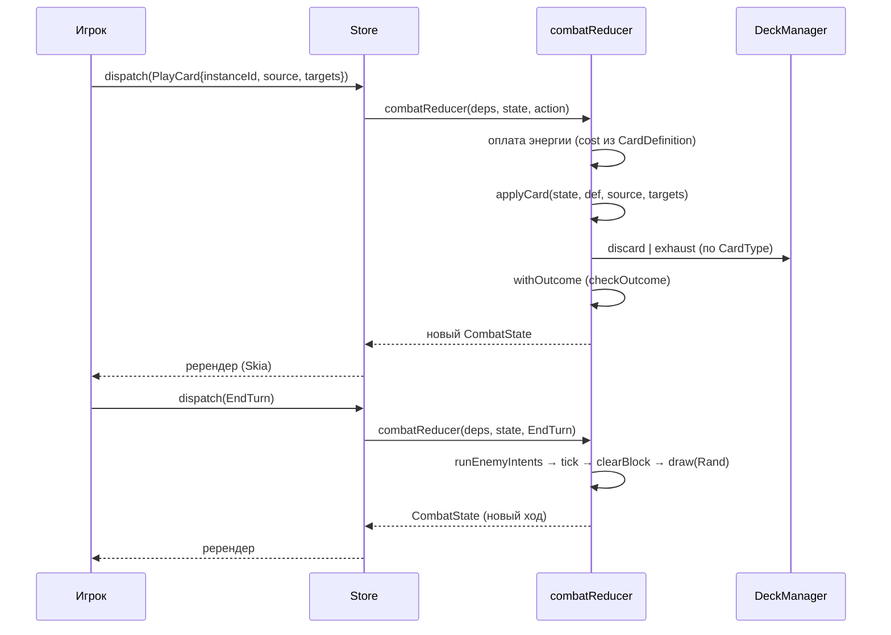

# Глава 5. Генерация уровня и боевая система

> Часть [архитектурного документа](README.md) проекта **Yar**.
>
> ⬅️ [Глава 4 ← Игровые системы](04-gameplay.md) · 🏠 [Оглавление](README.md) · [Глава 6 → Процесс разработки](06-development.md) ➡️

---

## Содержание главы

11. [Процедурная генерация уровня](#11-процедурная-генерация-уровня)
12. [Боевая система](#12-боевая-система)

Две ключевые алгоритмические подсистемы. Обе детерминированы по `seed` и реализованы как чистый TypeScript (`LevelGenerator`, `combatReducer` — см. [архитектуру домена §5](02-architecture.md#5-архитектура-домена)). Структуры данных — в главе [«Модель данных»](03-data-model.md).

---

## 11. Процедурная генерация уровня

Уровень — это **ориентированный ациклический граф (DAG)**, разбитый на слои-доли (отсюда **k-дольный**, *k-partite*): ровно один вход `start` и один корень-выход `end` (босс уровня). Рёбра направлены только «вперёд» — от истока к корню и лишь между соседними долями; обратных рёбер и циклов нет, поэтому забег всегда движется к боссу, а выбор игрока — это выбор маршрута внутри такой структуры. Именно этот класс графов мы и рассматриваем для уровня. Структура графа — в [§7.4](03-data-model.md#74-граф-уровня-k-дольный).

### 11.1. Алгоритм генерации



### 11.2. Параметры генерации (в `RuleSet`)

```typescript
export interface GenerationParams {
  readonly layerCount: { min: number; max: number };  // число долей k
  readonly layerWidth: { min: number; max: number };  // вершин в доле
  readonly nodeWeights: {                              // распределение типов
    readonly combat: number;
    readonly loot: number;
    readonly question: number;
  };
  readonly midBossCount: { min: number; max: number }; // 1-2 промежуточных
  readonly edgeDensity: number;                        // плотность рёбер 0..1
  readonly difficultyScaling: number;                  // рост сложности к end
}
```

> Генератор **детерминирован** по `seed`. Один и тот же сид → один и тот же уровень. Это упрощает отладку, тесты (см. [§14.5](06-development.md#145-стратегия-тестирования)) и потенциальные «daily challenge». Связность графа гарантируется валидатором с регенерацией при провале (см. [риски §13.2](06-development.md#132-архитектурные-риски)).

---

## 12. Боевая система

Полный игровой цикл боя описан в [§8.2](04-gameplay.md#82-главный-цикл-боя-combat-loop); здесь — поток действий через редьюсер и формулы. Действия — это **данные** (`CombatAction`), а `combatReducer(deps, state, action)` — чистая функция, диспетчеризуемая по типизированной таблице; отдельного сервис-класса движка нет.

### 12.1. Структура хода



### 12.2. Формулы (единая точка в `RuleSet`)

Урон — это разовый статус (`ApplyStatus`, `status: 'Damage'`, `lifetime: 'instant'`); его величина берётся из `Effect.value`. Все боевые модификаторы — это **статусы на сущности**, поэтому атака и блок выводятся из её статусов (нет аргументов `weaponBonus`/`statusModifier`): оружие и усиление — это `AttackUp`, щит — `Block`, «+сердце» и временное HP — `MaxHpUp`/`TempHp`.

```typescript
// Урон: источник «производит» op, цель «получает» его (Block поглощает)
damage = effect.value                       // базовое значение эффекта
       + attackPower(source)                // Σ статусов AttackUp (оружие + усиление)
       - block(target);                      // Σ статусов Block; RuleSet.damageFormula клампит в 0

// Максимальное HP сущности (выводится из статусов)
maxHp = entity.baseMaxHp
      + Σ MaxHpUp.stacks                     // «+сердце»
      + Σ TempHp.stacks;                     // временное HP (lifetime: fight)

// Block сбрасывается в начале хода владельца (clearBlock)
```

### 12.3. Поведение врагов

Враги действуют по предопределённому паттерну `intents` (см. [`EnemyDefinition` §7.5](03-data-model.md#75-враги-и-бой)), который игрок видит заранее — это снижает RNG-фрустрацию и делает бой тактическим. Текущее намерение хранится в `EnemyInstance.currentIntentIndex` и циклически продвигается каждый ход врага. Интенты исполняет редьюсер в действии `EndTurn` (`runEnemyIntents`), **без RNG**; индекс продвигается по модулю длины `intents`. «Атака» врага использует те же op-ы сущностей (`dealDamage`), что и карта игрока, — единый путь кода.

---

> ⬅️ [Глава 4 ← Игровые системы](04-gameplay.md) · 🏠 [Оглавление](README.md) · [Глава 6 → Процесс разработки](06-development.md) ➡️
