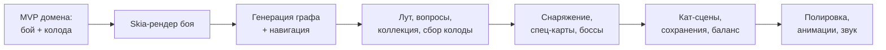
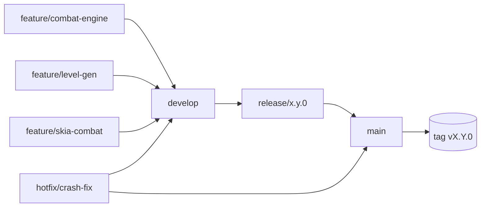
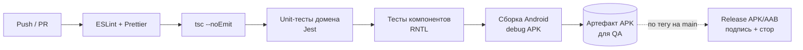
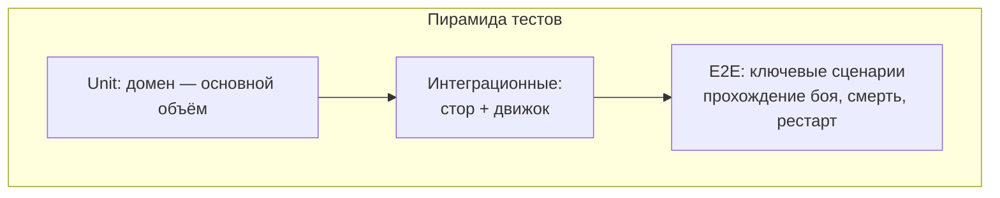

# Глава 6. Нефункциональные требования и процесс разработки

> Часть [архитектурного документа](README.md) проекта **Yar**.
>
> ⬅️ [Глава 5 ← Генерация и бой](05-generation-combat.md) · 🏠 [Оглавление](README.md)

---

## Содержание главы

13. [Нефункциональные требования и риски](#13-нефункциональные-требования-и-риски)
14. [Процесс разработки](#14-процесс-разработки)

---

## 13. Нефункциональные требования и риски

### 13.1. Нефункциональные требования

| Категория | Требование |
|-----------|-----------|
| **Производительность** | Стабильные 60 fps в бою на устройствах среднего уровня. |
| **Детерминизм** | Полная воспроизводимость по `seed` (генерация, шафл, лут). |
| **Тестируемость** | Доменный слой покрыт unit-тестами (Jest), без RN-зависимостей. |
| **Сохранения** | Мета-прогресс сохраняется атомарно; устойчивость к крашу. |
| **Расширяемость** | Добавление карты/врага = только данные в `content/`, без правок движка. |

> Детерминизм и тестируемость напрямую опираются на чистоту доменных модулей (см. [§5](02-architecture.md#5-архитектура-домена)) и сид-генерацию (см. [§11](05-generation-combat.md#11-процедурная-генерация-уровня)).

### 13.2. Архитектурные риски

| Риск | Митигация |
|------|-----------|
| Производительность Skia при множестве частиц | Пулинг объектов, ограничение FX, профилирование. |
| Сложность жизненного цикла карт | Жёсткая типизация `CardType`, изолированный `DeckManager`, тесты на каждый кейс (см. [§10.1](04-gameplay.md#101-жизненный-цикл-карты-внутри-одного-боя)). |
| Связность графа уровня (тупики/недостижимость) | Валидатор графа после генерации + регенерация при провале (см. [§11.1](05-generation-combat.md#111-алгоритм-генерации)). |
| Раздувание `GameStore` | Логика — в чистых редьюсерах домена; стор лишь диспатчит действия и читает селекторы. Срезы (slices) (см. [§6.2](02-architecture.md#62-структура-стора-zustand-срезы)). |
| Баланс сложности | Все формулы и константы в одном `RuleSet` для быстрого тюнинга. |

### 13.3. Этапы реализации (предлагаемый порядок)

---

## 14. Процесс разработки

### 14.1. Методология

Итеративная разработка короткими циклами с привязкой к этапам из раздела [§13.3](#133-этапы-реализации-предлагаемый-порядок). Каждый микроспринт завершается работоспособной сборкой, которую можно установить на устройство.

### 14.2. Git Flow

| Ветка | Назначение | Правила |
|-------|-----------|---------|
| `main` | Стабильный продакшен | Только через release/hotfix; защищена; каждый коммит = тег версии. |
| `develop` | Интеграционная ветка | Сюда мёрджатся все feature-ветки после ревью. |
| `feature/*` | Разработка фичи | Ветвится от `develop`, живёт коротко. |
| `release/*` | Стабилизация перед релизом | Только багфиксы, бамп версии, финальные тесты. |
| `hotfix/*` | Срочные правки прода | Ветвится от `main`, мёрджится в `main` и `develop`. |

### 14.3. Соглашения о коммитах и ветках

- **Conventional Commits:** `feat:`, `fix:`, `refactor:`, `test:`, `docs:`, `chore:`, `perf:`, `balance:`.
- Пример: `feat(combat): add exhaust pile for single-use cards`.
- Имена веток: `feature/<область>-<кратко>`, напр. `feature/deck-manager`.
- Каждый PR ссылается на задачу из проекта.

### 14.4. CI/CD пайплайн

| Стадия | Инструмент | Когда |
|--------|-----------|-------|
| Lint / формат | ESLint, Prettier | Каждый push/PR |
| Типы | `tsc --noEmit` | Каждый push/PR |
| Unit-тесты | Jest | Каждый push/PR |
| Тесты компонентов | React Native Testing Library | Каждый push/PR |
| Debug-сборка | Gradle / Expo EAS | На merge в `develop` |
| Release-сборка | Gradle (signed AAB) / EAS | На теге в `main` |

### 14.5. Стратегия тестирования

| Уровень | Что покрывает | Приоритет |
|---------|---------------|-----------|
| **Unit (домен)** | `combatReducer` (golden-state переходы), реестры (`STATUS_`/`EFFECT_`/`DECK_OP_`), op-ы сущностей, `DeckManager`, `CardResolver`, `LevelGenerator`, формулы `RuleSet`. Детерминизм по seed (монада `Rand`). | Высокий |
| **Интеграционные** | Связка `GameStore` ↔ движок: полный ход боя, сбор колоды, переход по графу. | Средний |
| **Компонентные** | Рендер экранов, реакция на действия (RNTL). | Средний |
| **E2E (опц.)** | Сквозные пути: забег → бой → победа/смерть → рестарт (Detox/Maestro). | По возможности |

Особое внимание (regression-кейсы):
- Permanent уходит в низ колоды и возвращается в том же бою.
- Single-use исчезает и не возвращается между боями уровня.
- Permanent-колода полностью восстанавливается между боями.
- Новая карта попадает в коллекцию, а не в активную колоду.
- Граф уровня всегда связен: start достижим до end.

> Эти кейсы напрямую покрывают [архитектурные риски §13.2](#132-архитектурные-риски) и правила жизненного цикла карт из [§10.1](04-gameplay.md#101-жизненный-цикл-карты-внутри-одного-боя).

### 14.6. Definition of Done

Задача считается готовой, когда:
- Код прошёл ревью и смёрджен в `develop`.
- CI зелёный (lint, типы, тесты).
- Новая логика покрыта тестами, regression-кейсы не сломаны.
- Нет регрессий производительности в бою (60 fps на референсном устройстве).
- Документация/комментарии обновлены, если менялся контракт домена.
- Изменения баланса отражены в `RuleSet` и задокументированы.

### 14.7. Версионирование и релизы

- **Semantic Versioning:** `MAJOR.MINOR.PATCH`.
  - `MAJOR` — несовместимые изменения формата сохранений.
  - `MINOR` — новый контент/фичи с обратной совместимостью.
  - `PATCH` — багфиксы и баланс.
- Android `versionCode` инкрементируется автоматически в CI.
- **Миграции сохранений:** при изменении схемы `Collection`/мета-данных — версионированные миграции в `PersistenceService`, чтобы не терять прогресс игроков.

---

> ⬅️ [Глава 5 ← Генерация и бой](05-generation-combat.md) · 🏠 [Оглавление](README.md)
