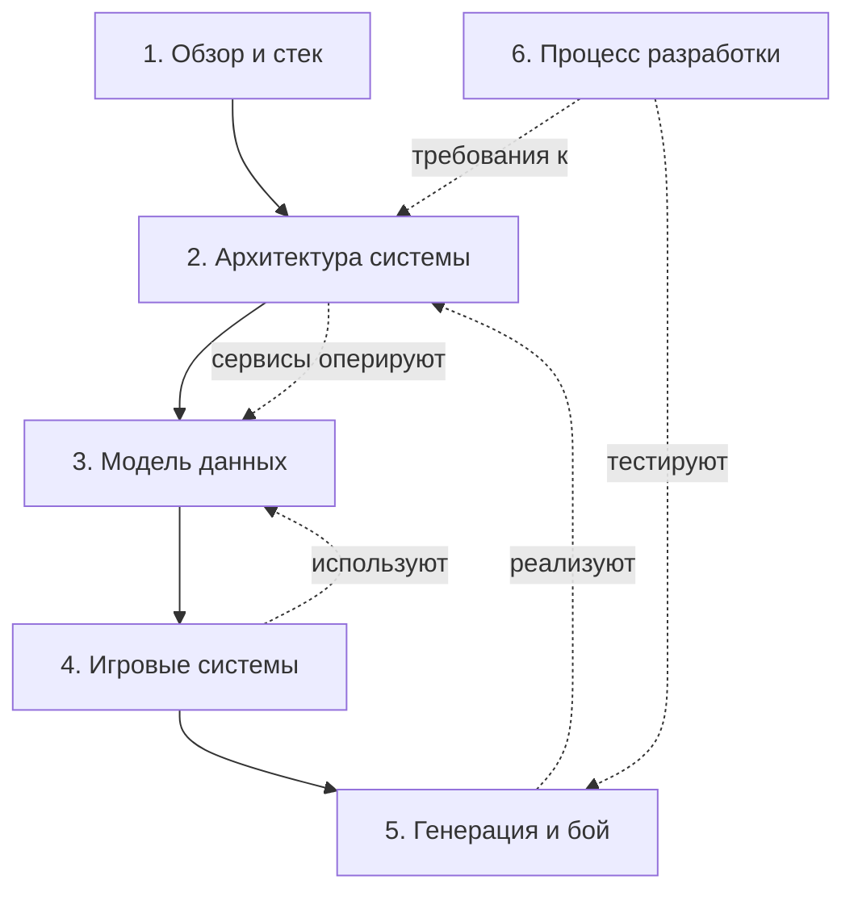

# Архитектурный документ: Yar — Card-based Roguelike (React Native + Skia)

## Карта документа

| # | Глава | Содержит разделы |
|---|-------|------------------|
| 1 | [Обзор, глоссарий и стек](01-overview.md) | 1. Обзор проекта · 2. Глоссарий · 3. Технический стек |
| 2 | [Архитектура системы](02-architecture.md) | 4. Архитектура C4 · 5. Архитектура классов · 6. Управление состоянием |
| 3 | [Модель данных](03-data-model.md) | 7. Доменная модель (карты, игрок, граф, бой, лут, забег) |
| 4 | [Игровые системы](04-gameplay.md) | 8. Игровые циклы · 9. User Flow · 10. Карточная система |
| 5 | [Генерация и бой](05-generation-combat.md) | 11. Процедурная генерация уровня · 12. Боевая система |
| 6 | [Процесс разработки](06-development.md) | 13. Нефункциональные требования и риски · 14. Процесс разработки |

## Как связаны главы

## С чего начать

- **Знакомство с проектом** → начните с [главы 1](01-overview.md): что за игра, ключевые термины, почему выбран этот стек.
- **Разработчику движка** → [глава 2](02-architecture.md) (структура сервисов) + [глава 3](03-data-model.md) (типы данных).
- **Геймдизайнеру** → [глава 4](04-gameplay.md) (циклы и карты) + [глава 5](05-generation-combat.md) (генерация и бой).
- **Контрибьютору** → [глава 6](06-development.md): Git Flow, конвенции коммитов, CI/CD, Definition of Done.
