# Архитектурный документ: Card-based Roguelike (React Native + Skia)

## Содержание

1. [Обзор проекта](#1-обзор-проекта)
2. [Глоссарий](#2-глоссарий)
3. [Технический стек](#3-технический-стек)
4. [Архитектура системы](#4-архитектура-системы-c4)
5. [Модель данных](#5-модель-данных)
6. [Архитектура классов](#6-архитектура-классов)
7. [Игровые циклы](#7-игровые-циклы-main-loops)
8. [User Flow](#8-user-flow)
9. [Карточная система](#9-карточная-система)
10. [Процедурная генерация уровня](#10-процедурная-генерация-уровня)
11. [Боевая система](#11-боевая-система)
12. [Управление состоянием](#12-управление-состоянием-state-management)
13. [Нефункциональные требования и риски](#13-нефункциональные-требования-и-риски)
14. [Процесс разработки](#14-процесс-разработки)

---

## 1. Обзор проекта

Yar(yet another rouge) — это **карточный roguelike** для Android.

### Ключевые принципы геймплея

| Аспект | Описание |
|--------|----------|
| **Структура** | Игрок проходит уровни, представленные графом локаций с монстрами, сундуками и загадками. |
| **Смерть** | При смерти забег начинается заново: полное здоровье, новая колода. Прогресс — в собранной коллекции карт. |
| **Экономика** | Денег нет. Перед уровнем игрок **выбирает N карт** в колоду из своей коллекции. |
| **Карты** | Два типа: `SingleUse` (одноразовые) и `Permanent` (перезагружаются каждый бой). |
| **Снаряжение** | Оружие и броня повышают атаку и здоровье. |
| **Прокачка** | Карты находятся в боях/сундуках, открываются в **хранилище** и доступны для следующего захода. |
| **Нарратив** | Перед уровнем и после победы над корневым боссом — текстовая кат-сцена. |

### Цикл прогрессии (high-level)

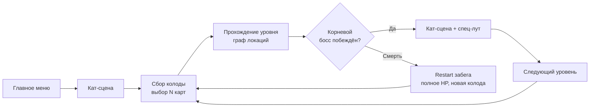
```mermaid
flowchart LR
    A[Главное меню] --> B[Кат-сцена]
    B --> C[Сбор колоды<br/>выбор N карт]
    C --> D[Прохождение уровня<br/>граф локаций]
    D --> E{Корневой<br/>босс побеждён?}
    E -- Да --> F[Кат-сцена + спец-лут]
    F --> G[Следующий уровень]
    G --> C
    E -- Смерть --> H[Restart забега<br/>полное HP, новая колода]
    H --> C
```

---

## 2. Глоссарий

| Термин | Определение |
|--------|-------------|
| **Run (Забег)** | Одна игровая попытка от старта до смерти. |
| **Level (Уровень)** | Граф локаций (k-дольный граф) от начала к концу. |
| **Start** | Стартовая вершина уровня (вход игрока). |
| **End** | Финальная вершина уровня с боссом. |
| **Node (Вершина)** | Локация на уровне: бой / сундук / вопрос / босс. |
| **Layer / Partition (Доля)** | Слой k-дольного графа. Рёбра идут между соседними долями. |
| **Collection (Коллекция)** | Хранилище всех открытых игроком карт (персистентно). |
| **Run Deck (Колода забега)** | Колода, собранная перед уровнем из коллекции; фиксируется до старта. |
| **Draw Pile (Колода добора)** | Карты, из которых тянут в бою. |
| **Hand (Рука)** | Карты, доступные к розыгрышу в текущий момент. |
| **Permanent card** | После розыгрыша уходит в низ колоды добора; восстанавливается между боями. |
| **Single-use card** | После розыгрыша исчезает; живёт только в пределах уровня. |

---

## 3. Технический стек

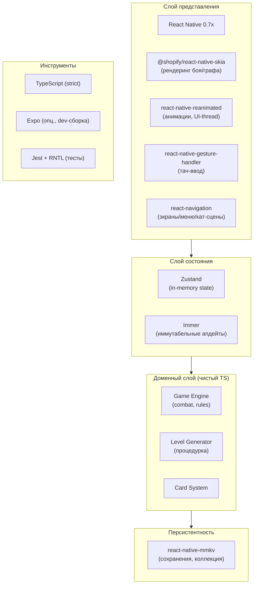
```mermaid
flowchart TB
    subgraph Presentation["Слой представления"]
        RN["React Native 0.7x"]
        SKIA["@shopify/react-native-skia<br/>(рендеринг боя/графа)"]
        REA["react-native-reanimated<br/>(анимации, UI-thread)"]
        GH["react-native-gesture-handler<br/>(тач-ввод)"]
        NAV["react-navigation<br/>(экраны/меню/кат-сцены)"]
    end

    subgraph Domain["Доменный слой (чистый TS)"]
        ENGINE["Game Engine<br/>(combat, rules)"]
        GEN["Level Generator<br/>(процедурка)"]
        CARDS["Card System"]
    end

    subgraph State["Слой состояния"]
        ZUSTAND["Zustand<br/>(in-memory state)"]
        IMMER["Immer<br/>(иммутабельные апдейты)"]
    end

    subgraph Persistence["Персистентность"]
        MMKV["react-native-mmkv<br/>(сохранения, коллекция)"]
    end

    subgraph Tooling["Инструменты"]
        TS["TypeScript (strict)"]
        EXPO["Expo (опц., dev-сборка)"]
        JEST["Jest + RNTL (тесты)"]
    end

    Presentation --> State
    State --> Domain
    Domain --> Persistence
```

### Обоснование выбора

| Технология | Назначение | Почему |
|------------|-----------|--------|
| **React Native** | Каркас приложения | Нативный Android, без браузера/WebView. |
| **Skia** | Рендеринг боя и графа | GPU-ускорение, 60 fps, кастомное рисование без движка. |
| **Reanimated 3** | Анимации | Работа в UI-потоке, нет джанков при анимации карт. |
| **Gesture Handler** | Drag-and-drop карт, тапы по вершинам | Жесты обрабатываются нативно. |
| **Zustand + Immer** | Состояние игры | Лёгкий, без бойлерплейта; домен изолирован от React. |
| **MMKV** | Сохранения | Самое быстрое key-value хранилище для RN. |
| **TypeScript strict** | Типобезопасность | Доменная модель строго типизирована. |

> Доменный слой (правила игры, генерация, бой) — это чистый TypeScript без зависимостей от React. React/Skia — только представление. Это даёт тестируемость и переносимость логики.

---

## 4. Архитектура системы

### 4.1. Контекст

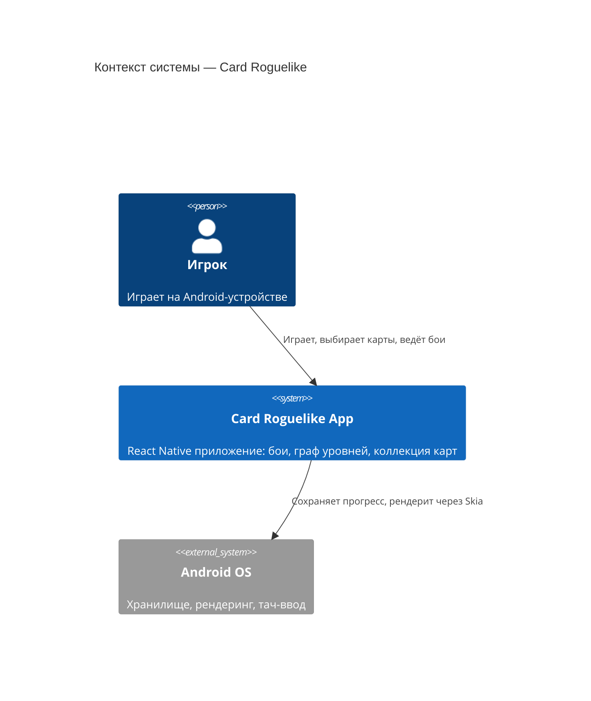
```mermaid
C4Context
    title Контекст системы — Card Roguelike

    Person(player, "Игрок", "Играет на Android-устройстве")

    System(game, "Card Roguelike App", "React Native приложение: бои, граф уровней, коллекция карт")

    System_Ext(os, "Android OS", "Хранилище, рендеринг, тач-ввод")

    Rel(player, game, "Играет, выбирает карты, ведёт бои")
    Rel(game, os, "Сохраняет прогресс, рендерит через Skia")
    UpdateRelStyle(player, game, $offsetY="-10")
```

### 4.2. Контейнеры

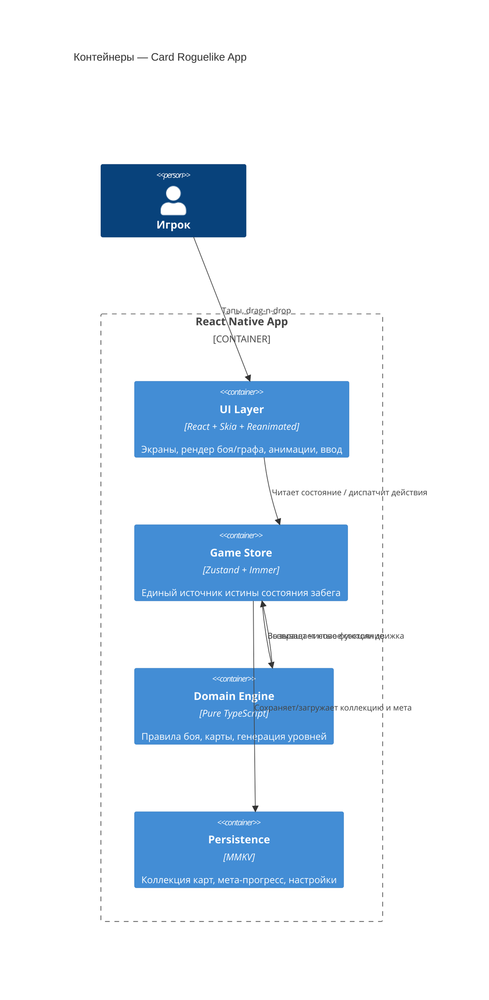
```mermaid
C4Container
    title Контейнеры — Card Roguelike App

    Person(player, "Игрок", "")

    Container_Boundary(app, "React Native App") {
        Container(ui, "UI Layer", "React + Skia + Reanimated", "Экраны, рендер боя/графа, анимации, ввод")
        Container(store, "Game Store", "Zustand + Immer", "Единый источник истины состояния забега")
        Container(domain, "Domain Engine", "Pure TypeScript", "Правила боя, карты, генерация уровней")
        Container(persist, "Persistence", "MMKV", "Коллекция карт, мета-прогресс, настройки")
    }

    Rel(player, ui, "Тапы, drag-n-drop")
    Rel(ui, store, "Читает состояние / диспатчит действия")
    Rel(store, domain, "Вызывает чистые функции движка")
    Rel(domain, store, "Возвращает новое состояние")
    Rel(store, persist, "Сохраняет/загружает коллекцию и мета")
```

### 4.3. Компоненты доменного движка

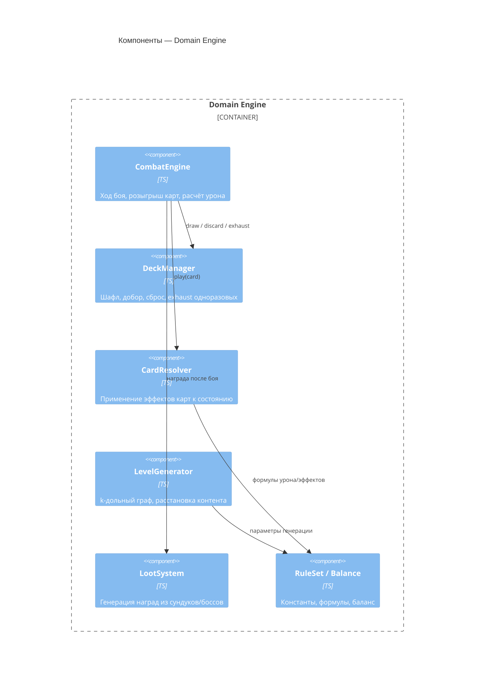
```mermaid
C4Component
    title Компоненты — Domain Engine

    Container_Boundary(domain, "Domain Engine") {
        Component(combat, "CombatEngine", "TS", "Ход боя, розыгрыш карт, расчёт урона")
        Component(deck, "DeckManager", "TS", "Шафл, добор, сброс, exhaust одноразовых")
        Component(cardres, "CardResolver", "TS", "Применение эффектов карт к состоянию")
        Component(gen, "LevelGenerator", "TS", "k-дольный граф, расстановка контента")
        Component(loot, "LootSystem", "TS", "Генерация наград из сундуков/боссов")
        Component(rules, "RuleSet / Balance", "TS", "Константы, формулы, баланс")
    }

    Rel(combat, deck, "draw / discard / exhaust")
    Rel(combat, cardres, "play(card)")
    Rel(cardres, rules, "формулы урона/эффектов")
    Rel(gen, rules, "параметры генерации")
    Rel(combat, loot, "награда после боя")
```

---

## 5. Модель данных

### 5.1. Карты

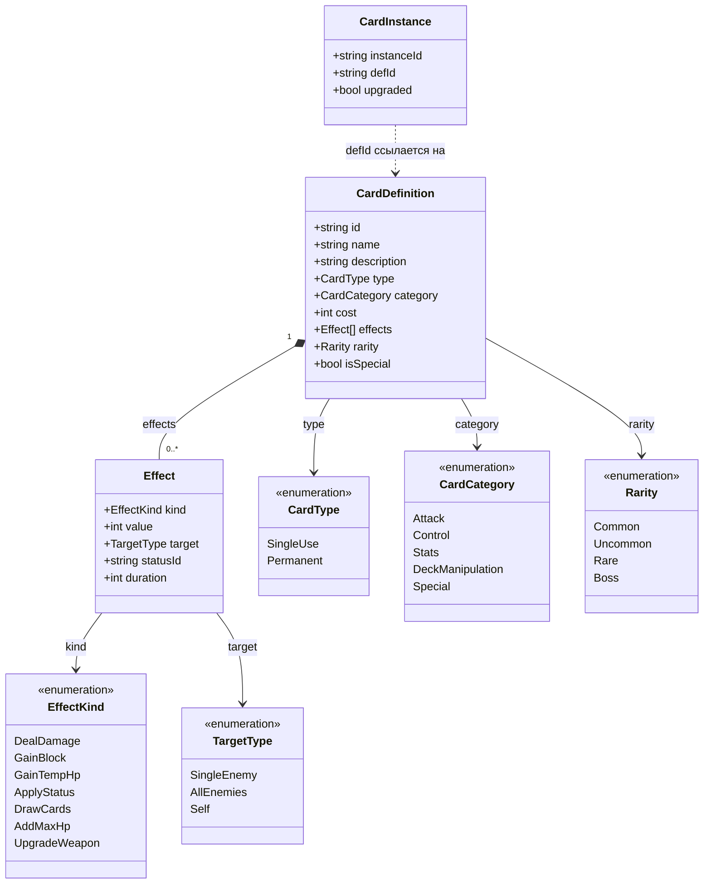
```mermaid
classDiagram
    class CardDefinition {
        +string id
        +string name
        +string description
        +CardType type
        +CardCategory category
        +int cost
        +Effect[] effects
        +Rarity rarity
        +bool isSpecial
    }
    class CardInstance {
        +string instanceId
        +string defId
        +bool upgraded
    }
    class Effect {
        +EffectKind kind
        +int value
        +TargetType target
        +string statusId
        +int duration
    }
    class CardType {
        <<enumeration>>
        SingleUse
        Permanent
    }
    class CardCategory {
        <<enumeration>>
        Attack
        Control
        Stats
        DeckManipulation
        Special
    }
    class EffectKind {
        <<enumeration>>
        DealDamage
        GainBlock
        GainTempHp
        ApplyStatus
        DrawCards
        AddMaxHp
        UpgradeWeapon
    }
    class TargetType {
        <<enumeration>>
        SingleEnemy
        AllEnemies
        Self
    }
    class Rarity {
        <<enumeration>>
        Common
        Uncommon
        Rare
        Boss
    }

    CardDefinition "1" *-- "0..*" Effect : effects
    CardDefinition --> CardType : type
    CardDefinition --> CardCategory : category
    CardDefinition --> Rarity : rarity
    Effect --> EffectKind : kind
    Effect --> TargetType : target
    CardInstance ..> CardDefinition : defId ссылается на
```

Примечания:
- `CardType` определяет жизненный цикл: `SingleUse` исчезает после розыгрыша (живёт в пределах уровня), `Permanent` уходит в низ колоды и восстанавливается между боями.
- `CardInstance` — забегтайм-экземпляр, ссылается на `CardDefinition` (instance ≠ definition).
- `isSpecial` / `Rarity.Boss` — карты, выпадающие только после корневого босса.

### 5.2. Игрок и снаряжение

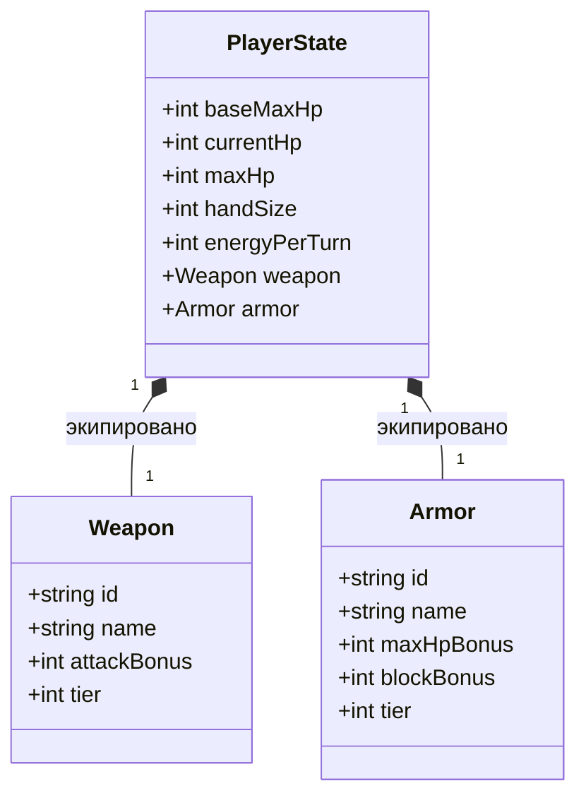
```mermaid
classDiagram
    class PlayerState {
        +int baseMaxHp
        +int currentHp
        +int maxHp
        +int handSize
        +int energyPerTurn
        +Weapon weapon
        +Armor armor
    }
    class Weapon {
        +string id
        +string name
        +int attackBonus
        +int tier
    }
    class Armor {
        +string id
        +string name
        +int maxHpBonus
        +int blockBonus
        +int tier
    }

    PlayerState "1" *-- "1" Weapon : экипировано
    PlayerState "1" *-- "1" Armor : экипировано
```

Примечания:
- `maxHp` = `baseMaxHp` + бонусы брони + спец-карты («+сердце»).
- `Weapon.attackBonus` прибавляется к урону атакующих карт; `Armor.maxHpBonus`/`blockBonus` — к HP и пассивному блоку.

### 5.3. Коллекция и колода (мета-уровень)

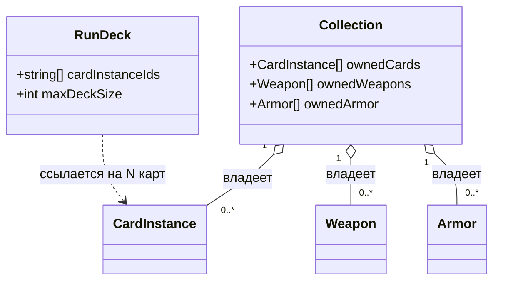
```mermaid
classDiagram
    class Collection {
        +CardInstance[] ownedCards
        +Weapon[] ownedWeapons
        +Armor[] ownedArmor
    }
    class RunDeck {
        +string[] cardInstanceIds
        +int maxDeckSize
    }

    Collection "1" o-- "0..*" CardInstance : владеет
    Collection "1" o-- "0..*" Weapon : владеет
    Collection "1" o-- "0..*" Armor : владеет
    RunDeck ..> CardInstance : ссылается на N карт
```

Примечания:
- `Collection` — персистентное хранилище всего, что игрок открыл.
- `RunDeck` — выбранные N карт перед уровнем; фиксируется до старта (`maxDeckSize` = ограничение N).

### 5.4. Граф уровня (k-дольный)

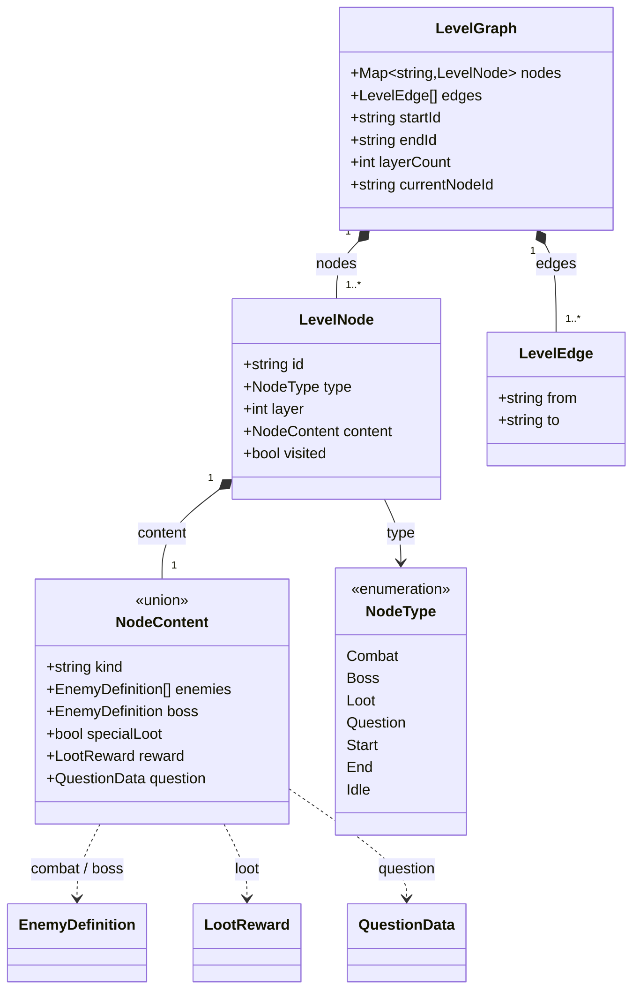
```mermaid
classDiagram
    class LevelGraph {
        +Map~string,LevelNode~ nodes
        +LevelEdge[] edges
        +string startId
        +string endId
        +int layerCount
        +string currentNodeId
    }
    class LevelNode {
        +string id
        +NodeType type
        +int layer
        +NodeContent content
        +bool visited
    }
    class LevelEdge {
        +string from
        +string to
    }
    class NodeContent {
        <<union>>
        +string kind
        +EnemyDefinition[] enemies
        +EnemyDefinition boss
        +bool specialLoot
        +LootReward reward
        +QuestionData question
    }
    class NodeType {
        <<enumeration>>
        Combat
        Boss
        Loot
        Question
        Start
        End
        Idle
    }

    LevelGraph "1" *-- "1..*" LevelNode : nodes
    LevelGraph "1" *-- "1..*" LevelEdge : edges
    LevelNode "1" *-- "1" NodeContent : content
    LevelNode --> NodeType : type
    NodeContent ..> EnemyDefinition : combat / boss
    NodeContent ..> LootReward : loot
    NodeContent ..> QuestionData : question
```

Примечания:
- `NodeContent` — размеченное объединение (discriminated union по полю `kind`): `combat` / `boss` / `loot` / `question` / `start`.
- `LevelEdge` направлено: `from` ближе к start, `to` ближе к end.

### 5.5. Враги и бой

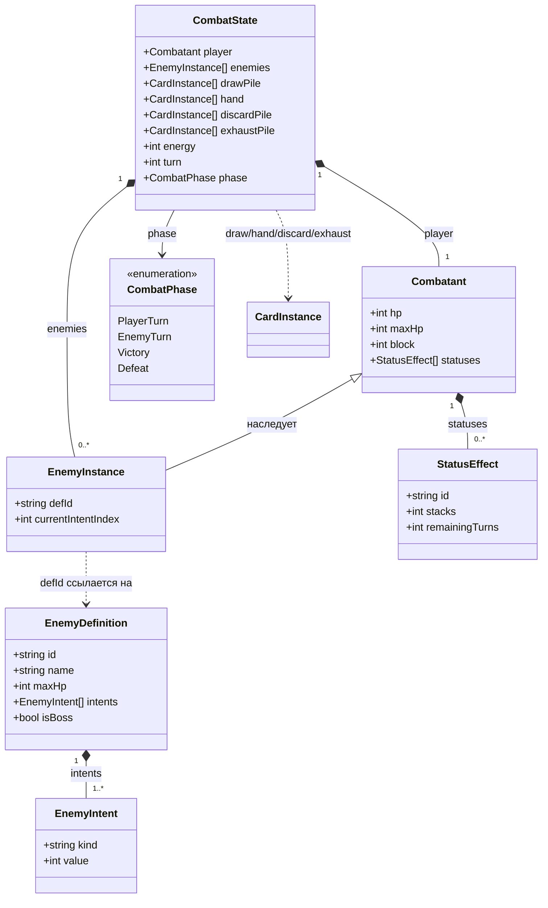
```mermaid
classDiagram
    class CombatState {
        +Combatant player
        +EnemyInstance[] enemies
        +CardInstance[] drawPile
        +CardInstance[] hand
        +CardInstance[] discardPile
        +CardInstance[] exhaustPile
        +int energy
        +int turn
        +CombatPhase phase
    }
    class Combatant {
        +int hp
        +int maxHp
        +int block
        +StatusEffect[] statuses
    }
    class EnemyInstance {
        +string defId
        +int currentIntentIndex
    }
    class EnemyDefinition {
        +string id
        +string name
        +int maxHp
        +EnemyIntent[] intents
        +bool isBoss
    }
    class EnemyIntent {
        +string kind
        +int value
    }
    class StatusEffect {
        +string id
        +int stacks
        +int remainingTurns
    }
    class CombatPhase {
        <<enumeration>>
        PlayerTurn
        EnemyTurn
        Victory
        Defeat
    }

    Combatant <|-- EnemyInstance : наследует
    CombatState "1" *-- "1" Combatant : player
    CombatState "1" *-- "0..*" EnemyInstance : enemies
    CombatState --> CombatPhase : phase
    CombatState ..> CardInstance : draw/hand/discard/exhaust
    Combatant "1" *-- "0..*" StatusEffect : statuses
    EnemyInstance ..> EnemyDefinition : defId ссылается на
    EnemyDefinition "1" *-- "1..*" EnemyIntent : intents
```

Примечания:
- `block` (временный щит) сбрасывается каждый ход.
- `drawPile` — перемешанная колода добора; `discardPile` — сброс permanent-карт; `exhaustPile` — отыгранные single-use (визуально).
- `EnemyInstance` расширяет `Combatant` и хранит ссылку на `EnemyDefinition` + текущий intent.

### 5.6. Лут и вопросы

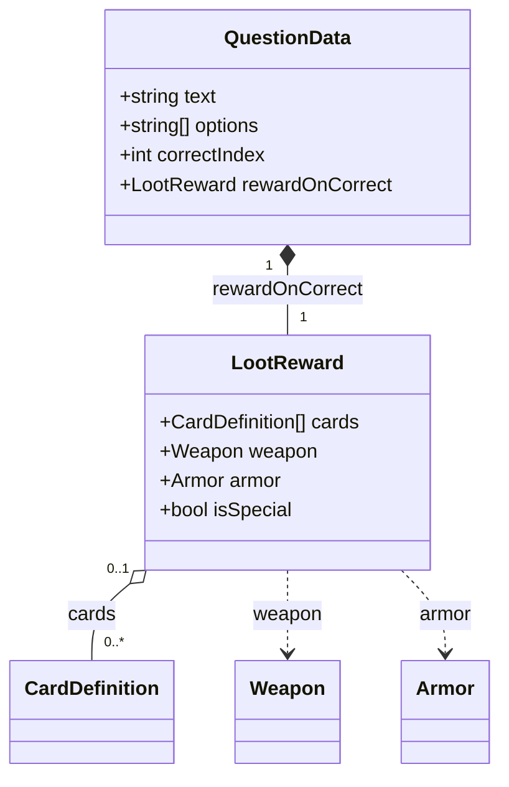
```mermaid
classDiagram
    class LootReward {
        +CardDefinition[] cards
        +Weapon weapon
        +Armor armor
        +bool isSpecial
    }
    class QuestionData {
        +string text
        +string[] options
        +int correctIndex
        +LootReward rewardOnCorrect
    }

    LootReward "0..1" o-- "0..*" CardDefinition : cards
    LootReward ..> Weapon : weapon
    LootReward ..> Armor : armor
    QuestionData "1" *-- "1" LootReward : rewardOnCorrect
```

Примечания:
- `isSpecial` помечает спец-лут после end-босса.
- При неверном ответе на вопрос — пусто (empty): без штрафа и без награды.

### 5.7. Состояние забега

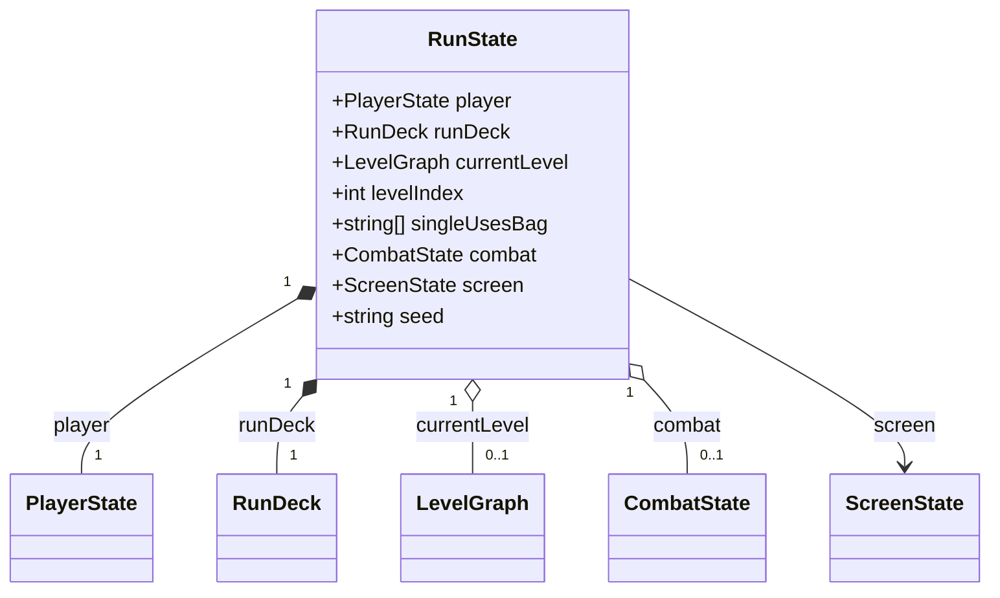
```mermaid
classDiagram
    class RunState {
        +PlayerState player
        +RunDeck runDeck
        +LevelGraph currentLevel
        +int levelIndex
        +string[] singleUsesBag
        +CombatState combat
        +ScreenState screen
        +string seed
    }

    RunState "1" *-- "1" PlayerState : player
    RunState "1" *-- "1" RunDeck : runDeck
    RunState "1" o-- "0..1" LevelGraph : currentLevel
    RunState "1" o-- "0..1" CombatState : combat
    RunState --> ScreenState : screen
```

Примечания:
- `currentLevel` и `combat` опциональны (`null`, когда уровень/бой не активны).
- `singleUseBag` — id одноразовых карт, имеющихся на текущем уровне (отдельный цикл жизни).
- `seed` — детерминированный сид процедурной генерации забега.

### 5.8. Сводная диаграмма связей доменной модели

Обзорная ER-диаграмма, связывающая все агрегаты модели воедино (детали полей — в диаграммах классов 5.1–5.7 выше).

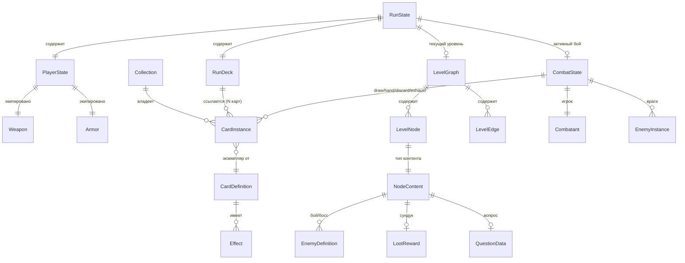
```mermaid
erDiagram
    RunState ||--|| PlayerState : содержит
    RunState ||--|| RunDeck : содержит
    RunState ||--o| LevelGraph : "текущий уровень"
    RunState ||--o| CombatState : "активный бой"

    PlayerState ||--|| Weapon : экипировано
    PlayerState ||--|| Armor : экипировано

    Collection ||--o{ CardInstance : владеет
    RunDeck ||--o{ CardInstance : "ссылается (N карт)"
    CardInstance }o--|| CardDefinition : "экземпляр от"
    CardDefinition ||--o{ Effect : имеет

    LevelGraph ||--o{ LevelNode : содержит
    LevelGraph ||--o{ LevelEdge : содержит
    LevelNode ||--|| NodeContent : "тип контента"
    NodeContent ||--o{ EnemyDefinition : "бой/босс"
    NodeContent ||--o| LootReward : "сундук"
    NodeContent ||--o| QuestionData : "вопрос"

    CombatState ||--|| Combatant : "игрок"
    CombatState ||--o{ EnemyInstance : враги
    CombatState ||--o{ CardInstance : "draw/hand/discard/exhaust"
```

---

## 6. Архитектура классов

Доменный движок построен на чистых сервисах и иммутабельных reducer-функциях. React-компоненты лишь подписаны на стор.

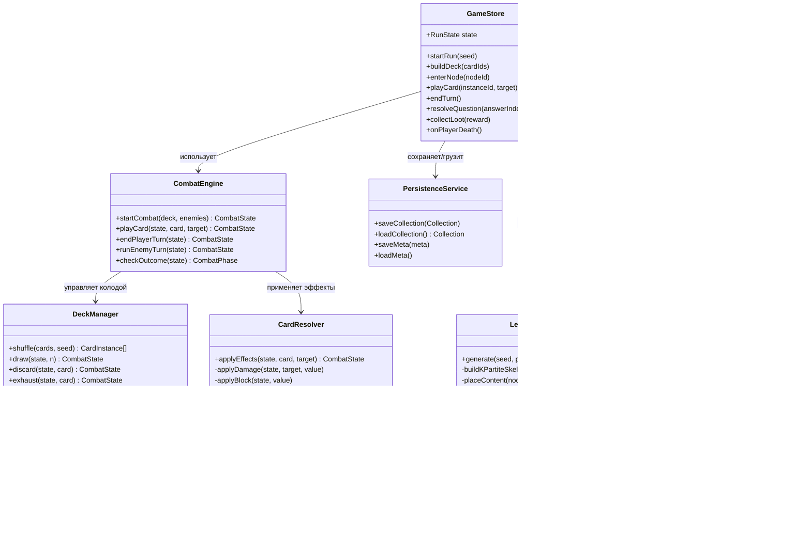
```mermaid
classDiagram
    class GameStore {
        +RunState state
        +startRun(seed)
        +buildDeck(cardIds)
        +enterNode(nodeId)
        +playCard(instanceId, target)
        +endTurn()
        +resolveQuestion(answerIndex)
        +collectLoot(reward)
        +onPlayerDeath()
    }

    class CombatEngine {
        +startCombat(deck, enemies) CombatState
        +playCard(state, card, target) CombatState
        +endPlayerTurn(state) CombatState
        +runEnemyTurn(state) CombatState
        +checkOutcome(state) CombatPhase
    }

    class DeckManager {
        +shuffle(cards, seed) CardInstance[]
        +draw(state, n) CombatState
        +discard(state, card) CombatState
        +exhaust(state, card) CombatState
        +reshuffleDiscardIntoDraw(state) CombatState
        +resetPermanentDeck(deck) CardInstance[]
    }

    class CardResolver {
        +applyEffects(state, card, target) CombatState
        -applyDamage(state, target, value)
        -applyBlock(state, value)
        -applyStatus(state, target, status)
    }

    class LevelGenerator {
        +generate(seed, params) LevelGraph
        -buildKPartiteSkeleton(layers)
        -placeContent(nodes, params)
        -placeBosses(graph)
    }

    class LootSystem {
        +rollChestLoot(seed, depth) LootReward
        +rollBossLoot(seed, isend) LootReward
    }

    class RuleSet {
        +damageFormula(base, weapon, statuses) number
        +maxHpFormula(base, armor, specials) number
        +GENERATION_PARAMS
        +BALANCE_CONSTANTS
    }

    class PersistenceService {
        +saveCollection(Collection)
        +loadCollection() Collection
        +saveMeta(meta)
        +loadMeta()
    }

    GameStore --> CombatEngine : использует
    GameStore --> LevelGenerator : использует
    GameStore --> LootSystem : использует
    GameStore --> PersistenceService : сохраняет/грузит
    CombatEngine --> DeckManager : управляет колодой
    CombatEngine --> CardResolver : применяет эффекты
    CardResolver --> RuleSet : формулы
    LevelGenerator --> RuleSet : параметры
    LootSystem --> RuleSet : вероятности
```

### Разделение ответственности

| Класс/Сервис | Чистый? | Ответственность |
|--------------|---------|-----------------|
| `GameStore` | Нет (Zustand) | Оркестрация, единый источник истины, диспатч действий. |
| `CombatEngine` | Да | Полный цикл боя, переходы фаз. |
| `DeckManager` | Да | Жизненный цикл карт: шафл/добор/сброс/exhaust. |
| `CardResolver` | Да | Применение эффектов карт к состоянию. |
| `LevelGenerator` | Да | Построение k-дольного графа и контента. |
| `LootSystem` | Да | Генерация наград. |
| `RuleSet` | Да | Константы баланса и формулы (единая точка тюнинга). |
| `PersistenceService` | Нет (I/O) | Сохранение/загрузка через MMKV. |

> Все чистые сервисы детерминированы относительно `seed` — это критично для воспроизводимости забега и тестирования.

---

## 7. Игровые циклы (Main Loops)

### 7.1. Цикл забега (Run Loop)

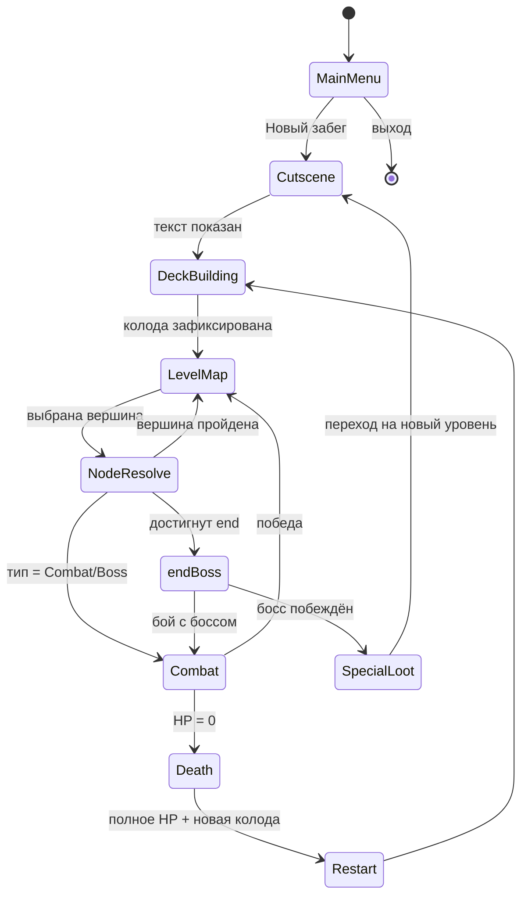
```mermaid
stateDiagram-v2
    [*] --> MainMenu
    MainMenu --> Cutscene: Новый забег
    Cutscene --> DeckBuilding: текст показан
    DeckBuilding --> LevelMap: колода зафиксирована
    LevelMap --> NodeResolve: выбрана вершина
    NodeResolve --> LevelMap: вершина пройдена
    NodeResolve --> Combat: тип = Combat/Boss
    Combat --> LevelMap: победа
    Combat --> Death: HP = 0
    NodeResolve --> endBoss: достигнут end
    endBoss --> Combat: бой с боссом
    endBoss --> SpecialLoot: босс побеждён
    SpecialLoot --> Cutscene: переход на новый уровень
    Death --> Restart: полное HP + новая колода
    Restart --> DeckBuilding
    MainMenu --> [*]: выход
```

### 7.2. Главный цикл боя (Combat Loop)

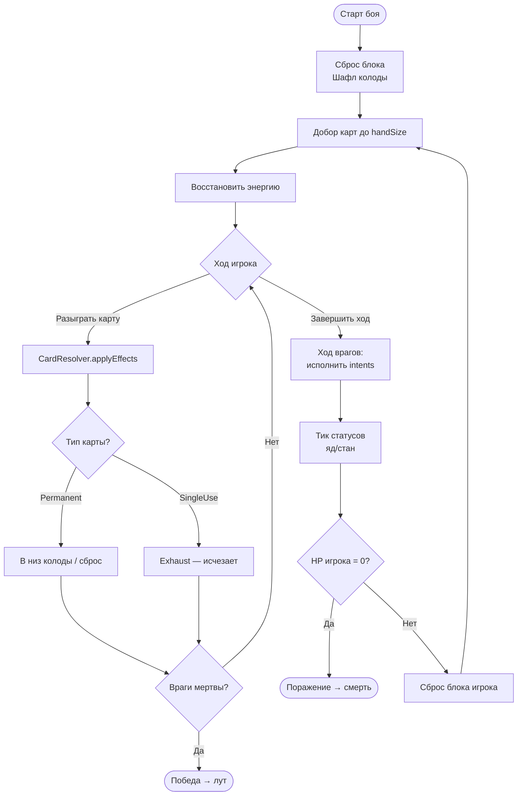
```mermaid
flowchart TD
    start([Старт боя]) --> INIT[Сброс блока<br/>Шафл колоды]
    INIT --> DRAW[Добор карт до handSize]
    DRAW --> ENERGY[Восстановить энергию]
    ENERGY --> PLAYER{Ход игрока}

    PLAYER -->|Разыграть карту| PLAYCARD[CardResolver.applyEffects]
    PLAYCARD --> CARDTYPE{Тип карты?}
    CARDTYPE -->|Permanent| TOBOTTOM[В низ колоды / сброс]
    CARDTYPE -->|SingleUse| EXHAUST[Exhaust — исчезает]
    TOBOTTOM --> CHECK1{Враги мертвы?}
    EXHAUST --> CHECK1
    CHECK1 -->|Да| VICTORY([Победа → лут])
    CHECK1 -->|Нет| PLAYER

    PLAYER -->|Завершить ход| ENEMYTURN[Ход врагов:<br/>исполнить intents]
    ENEMYTURN --> STATUSES[Тик статусов<br/>яд/стан]
    STATUSES --> CHECK2{HP игрока = 0?}
    CHECK2 -->|Да| DEFEAT([Поражение → смерть])
    CHECK2 -->|Нет| RESETBLOCK[Сброс блока игрока]
    RESETBLOCK --> DRAW
```

---

## 8. User Flow

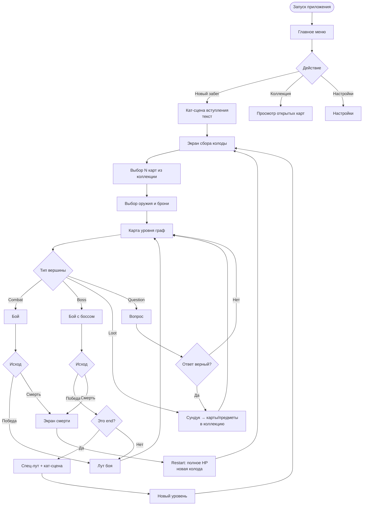
```mermaid
flowchart TD
    A([Запуск приложения]) --> B[Главное меню]
    B --> C{Действие}
    C -->|Новый забег| D[Кат-сцена вступления<br/>текст]
    C -->|Коллекция| E[Просмотр открытых карт]
    C -->|Настройки| F[Настройки]

    D --> G[Экран сбора колоды]
    G --> G1[Выбор N карт из коллекции]
    G1 --> G2[Выбор оружия и брони]
    G2 --> H[Карта уровня граф]

    H --> I{Тип вершины}
    I -->|Combat| J[Бой]
    I -->|Boss| K[Бой с боссом]
    I -->|Loot| L[Сундук → карты/предметы<br/>в коллекцию]
    I -->|Question| M[Вопрос]

    M --> M1{Ответ верный?}
    M1 -->|Да| L
    M1 -->|Нет| H

    J --> J1{Исход}
    J1 -->|Победа| N[Лут боя] --> H
    J1 -->|Смерть| O[Экран смерти]

    K --> K1{Исход}
    K1 -->|Победа| P{Это end?}
    P -->|Да| Q[Спец-лут + кат-сцена] --> R[Новый уровень] --> G
    P -->|Нет| N
    K1 -->|Смерть| O

    O --> O1[Restart: полное HP<br/>новая колода] --> G

    L --> H
```

### Описание ключевых экранов

| Экран | Назначение | Технология рендера |
|-------|-----------|--------------------|
| **Главное меню** | Старт, коллекция, настройки | React Native UI |
| **Кат-сцена** | Текстовый нарратив (typewriter) | RN + Reanimated |
| **Сбор колоды** | Выбор N карт, оружия, брони | RN UI + жесты |
| **Карта уровня** | Граф локаций, навигация | **Skia** (узлы/рёбра) + жесты |
| **Бой** | Карты, рука, враги, анимации | **Skia** + Reanimated + Gesture Handler |
| **Сундук / Вопрос** | Награда / квиз | RN UI |
| **Экран смерти** | Итоги, рестарт | RN UI |

---

## 9. Карточная система

Самая важная подсистема. Точно отражает уточнённые правила жизненного цикла карт.

### 9.1. Жизненный цикл карты (внутри одного боя)

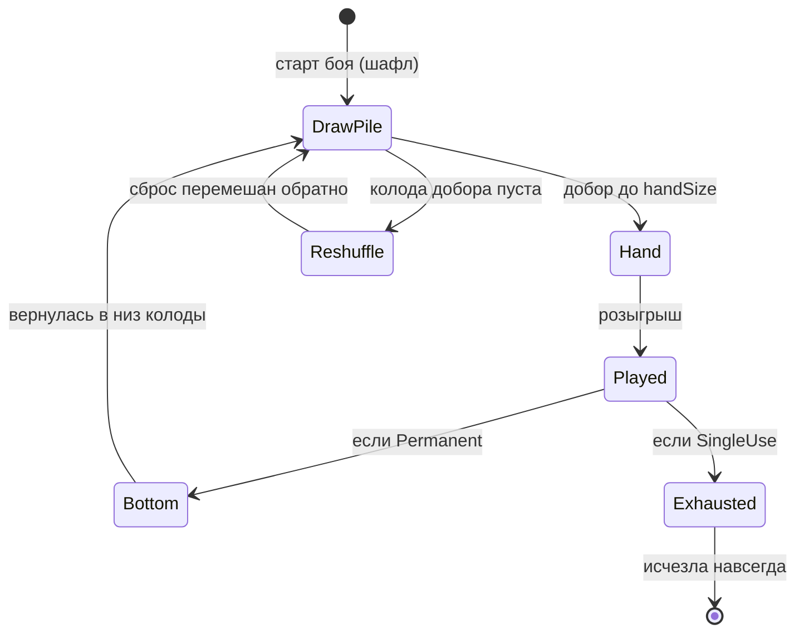
```mermaid
stateDiagram-v2
    [*] --> DrawPile: старт боя (шафл)
    DrawPile --> Hand: добор до handSize
    Hand --> Played: розыгрыш
    Played --> Bottom: если Permanent
    Played --> Exhausted: если SingleUse
    Bottom --> DrawPile: вернулась в низ колоды
    Exhausted --> [*]: исчезла навсегда
    DrawPile --> Reshuffle: колода добора пуста
    Reshuffle --> DrawPile: сброс перемешан обратно
```

### 9.2. Откуда берутся карты

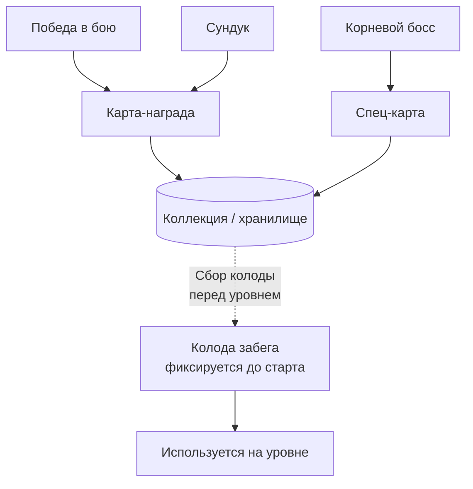
```mermaid
flowchart TD
    FIGHT[Победа в бою] --> DROP[Карта-награда]
    CHEST[Сундук] --> DROP
    BOSS[Корневой босс] --> SPECIAL[Спец-карта]
    DROP --> STORAGE[(Коллекция / хранилище)]
    SPECIAL --> STORAGE
    STORAGE -.->|Сбор колоды<br/>перед уровнем| DECK[Колода забега<br/>фиксируется до старта]
    DECK --> PLAY[Используется на уровне]
```

> Новые карты **не** попадают в текущую колоду. Они открываются в коллекции и доступны для сборки колоды перед **следующим** заходом. Колода уровня фиксируется до старта и не пополняется в процессе.

### 9.3. Категории карт (примеры)

| Категория | Примеры | Тип |
|-----------|---------|-----|
| **Attack** | Удар, Веерный удар (по всем), Тяжёлый удар | Обычно Permanent |
| **Control** | Заморозка, Стан, Слабость | Permanent/SingleUse |
| **Stats** | Щит, Временное HP | Permanent |
| **DeckManipulation** | Добор +2, Перемешать, Найти карту | Permanent |
| **Special** | +Сердце (max HP), Улучшить оружие | Обычно SingleUse |

---

## 10. Процедурная генерация уровня

Уровень — это **k-дольный (k-partite) граф**: один start, один end(корень/босс), рёбра идут от истока к корню между соседними долями.

### 10.1. Алгоритм генерации

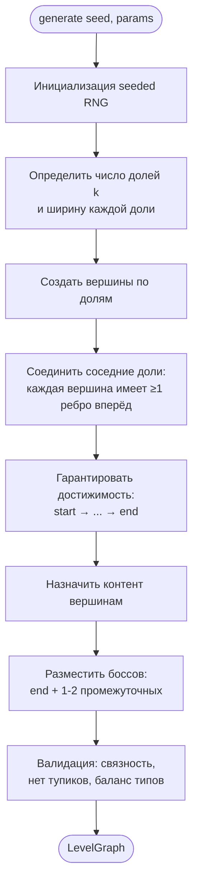
```mermaid
flowchart TD
    start([generate seed, params]) --> RNG[Инициализация seeded RNG]
    RNG --> LAYERS[Определить число долей k<br/>и ширину каждой доли]
    LAYERS --> NODES[Создать вершины по долям]
    NODES --> EDGES[Соединить соседние доли:<br/>каждая вершина имеет ≥1 ребро вперёд]
    EDGES --> CONNECT[Гарантировать достижимость:<br/>start → ... → end]
    CONNECT --> CONTENT[Назначить контент вершинам]
    CONTENT --> BOSSES[Разместить боссов:<br/>end + 1-2 промежуточных]
    BOSSES --> VALIDATE[Валидация: связность,<br/>нет тупиков, баланс типов]
    VALIDATE --> OUT([LevelGraph])
```

### 10.2. Параметры генерации (в `RuleSet`)

```typescript
export interface GenerationParams {
  readonly layerCount: { min: number; max: number };  // число долей k
  readonly layerWidth: { min: number; max: number };  // вершин в доле
  readonly nodeWeights: {                              // распределение типов
    readonly combat: number;
    readonly loot: number;
    readonly question: number;
  };
  readonly midBossCount: { min: number; max: number }; // 1-2 промежуточных
  readonly edgeDensity: number;                        // плотность рёбер 0..1
  readonly difficultyScaling: number;                  // рост сложности к end
}
```

> Генератор **детерминирован** по `seed`. Один и тот же сид → один и тот же уровень. Это упрощает отладку, тесты и потенциальные «daily challenge».

---

## 11. Боевая система

### 11.1. Структура хода

```mermaid
sequenceDiagram
    participant U as Игрок
    participant S as GameStore
    participant E as CombatEngine
    participant D as DeckManager
    participant R as CardResolver

    U->>S: playCard(instanceId, target)
    S->>E: playCard(state, card, target)
    E->>R: applyEffects(state, card, target)
    R-->>E: новое CombatState
    E->>D: discard/exhaust(card)
    D-->>E: обновлённые стопки
    E->>E: checkOutcome(state)
    E-->>S: CombatState
    S-->>U: ререндер (Skia)

    U->>S: endTurn()
    S->>E: endPlayerTurn(state)
    E->>E: runEnemyTurn (исполнить intents)
    E->>D: draw до handSize
    E-->>S: CombatState (новый ход)
    S-->>U: ререндер
```

### 11.2. Формулы (единая точка в `RuleSet`)

```typescript
// Урон атакующей карты
damage = card.baseDamage
       + weapon.attackBonus
       + statusModifiers(player.statuses)   // напр. усиление
       - target.block;                       // блок поглощает урон

// Максимальное HP игрока
maxHp = player.baseMaxHp
      + armor.maxHpBonus
      + specialCardsBonus;                   // карты «+сердце»

// Эффективный блок врага сбрасывается в начале его хода
```

### 11.3. Поведение врагов (?)

Враги действуют по предопределённому паттерну `intents`, который игрок видит заранее — это снижает RNG-фрустрацию и делает бой тактическим.

---

## 12. Управление состоянием (State Management)

### 12.1. Принцип

```mermaid
flowchart TB
    UI[React Components / Skia] -->|action| STORE[GameStore Zustand]
    STORE -->|вызов чистой функции| ENGINE[Domain Engine pure TS]
    ENGINE -->|новый immutable state| STORE
    STORE -->|selector| UI
    STORE -->|side-effect: save| MMKV[(MMKV)]
    MMKV -->|hydrate at boot| STORE
```

### 12.2. Структура стора (Zustand-срезы)

| Срез | Содержит | Персистентность |
|------|----------|-----------------|
| `runSlice` | `RunState` — текущий забег | Только in-memory (теряется при смерти). |
| `combatSlice` | `CombatState` — активный бой | In-memory. |
| `metaSlice` | `Collection`, прогресс, разблокировки | **Персистентно (MMKV)**. |
| `settingsSlice` | Звук, язык, сложность | **Персистентно (MMKV)**. |


---

## 13. Нефункциональные требования и риски

### 13.1. Нефункциональные требования

| Категория | Требование |
|-----------|-----------|
| **Производительность** | Стабильные 60 fps в бою на устройствах среднего уровня. |
| **Детерминизм** | Полная воспроизводимость по `seed` (генерация, шафл, лут). |
| **Тестируемость** | Доменный слой покрыт unit-тестами (Jest), без RN-зависимостей. |
| **Сохранения** | Мета-прогресс сохраняется атомарно; устойчивость к крашу. |
| **Расширяемость** | Добавление карты/врага = только данные в `content/`, без правок движка. |

### 13.2. Архитектурные риски

| Риск | Митигация |
|------|-----------|
| Производительность Skia при множестве частиц | Пулинг объектов, ограничение FX, профилирование. |
| Сложность жизненного цикла карт | Жёсткая типизация `CardType`, изолированный `DeckManager`, тесты на каждый кейс. |
| Связность графа уровня (тупики/недостижимость) | Валидатор графа после генерации + регенерация при провале. |
| Раздувание `GameStore` | Срезы (slices) + изоляция чистой логики в `domain/`. |
| Баланс сложности | Все формулы и константы в одном `RuleSet` для быстрого тюнинга. |

### 13.3. Этапы реализации (предлагаемый порядок)

```mermaid
flowchart LR
    M1[MVP домена:<br/>бой + колода] --> M2[Skia-рендер боя]
    M2 --> M3[Генерация графа<br/>+ навигация]
    M3 --> M4[Лут, вопросы,<br/>коллекция, сбор колоды]
    M4 --> M5[Снаряжение,<br/>спец-карты, боссы]
    M5 --> M6[Кат-сцены,<br/>сохранения, баланс]
    M6 --> M7[Полировка,<br/>анимации, звук]
```

---

## 14. Процесс разработки

### 14.1. Методология

Итеративная разработка короткими циклами с привязкой к этапам из раздела 15.3. Каждый микроспринт завершается работоспособной сборкой, которую можно установить на устройство.

### 14.2. Git Flow

```mermaid
flowchart LR
    F1[feature/combat-engine] --> DEV[develop]
    F2[feature/level-gen] --> DEV
    F3[feature/skia-combat] --> DEV
    DEV --> RC[release/x.y.0]
    RC --> MAIN[main]
    MAIN --> TAG[(tag vX.Y.0)]
    HOT[hotfix/crash-fix] --> MAIN
    HOT --> DEV
```

| Ветка | Назначение | Правила |
|-------|-----------|---------|
| `main` | Стабильный продакшен | Только через release/hotfix; защищена; каждый коммит = тег версии. |
| `develop` | Интеграционная ветка | Сюда мёрджатся все feature-ветки после ревью. |
| `feature/*` | Разработка фичи | Ветвится от `develop`, живёт коротко. |
| `release/*` | Стабилизация перед релизом | Только багфиксы, бамп версии, финальные тесты. |
| `hotfix/*` | Срочные правки прода | Ветвится от `main`, мёрджится в `main` и `develop`. |

### 14.3. Соглашения о коммитах и ветках

- **Conventional Commits:** `feat:`, `fix:`, `refactor:`, `test:`, `docs:`, `chore:`, `perf:`, `balance:`.
- Пример: `feat(combat): add exhaust pile for single-use cards`.
- Имена веток: `feature/<область>-<кратко>`, напр. `feature/deck-manager`.
- Каждый PR ссылается на задачу из проекта.

### 14.4. CI/CD пайплайн

```mermaid
flowchart LR
    PUSH[Push / PR] --> LINT[ESLint + Prettier]
    LINT --> TYPES[tsc --noEmit]
    TYPES --> UNIT[Unit-тесты домена<br/>Jest]
    UNIT --> COMP[Тесты компонентов<br/>RNTL]
    COMP --> BUILD[Сборка Android<br/>debug APK]
    BUILD --> ART[(Артефакт APK<br/>для QA)]
    ART -.->|по тегу на main| RELEASE[Release APK/AAB<br/>подпись + стор]
```

| Стадия | Инструмент | Когда |
|--------|-----------|-------|
| Lint / формат | ESLint, Prettier | Каждый push/PR |
| Типы | `tsc --noEmit` | Каждый push/PR |
| Unit-тесты | Jest | Каждый push/PR |
| Тесты компонентов | React Native Testing Library | Каждый push/PR |
| Debug-сборка | Gradle / Expo EAS | На merge в `develop` |
| Release-сборка | Gradle (signed AAB) / EAS | На теге в `main` |

### 14.5. Стратегия тестирования

```mermaid
flowchart TB
    subgraph Пирамида тестов
        E2E[E2E: ключевые сценарии<br/>прохождение боя, смерть, рестарт]
        INT[Интеграционные:<br/>стор + движок]
        UNIT[Unit: домен — основной объём]
    end
    UNIT --> INT --> E2E
```

| Уровень | Что покрывает | Приоритет |
|---------|---------------|-----------|
| **Unit (домен)** | `CombatEngine`, `DeckManager`, `CardResolver`, `LevelGenerator`, формулы `RuleSet`. Детерминизм по seed. | Высокий |
| **Интеграционные** | Связка `GameStore` ↔ движок: полный ход боя, сбор колоды, переход по графу. | Средний |
| **Компонентные** | Рендер экранов, реакция на действия (RNTL). | Средний |
| **E2E (опц.)** | Сквозные пути: забег → бой → победа/смерть → рестарт (Detox/Maestro). | По возможности |

Особое внимание (regression-кейсы):
- Permanent уходит в низ колоды и возвращается в том же бою.
- Single-use исчезает и не возвращается между боями уровня.
- Permanent-колода полностью восстанавливается между боями.
- Новая карта попадает в коллекцию, а не в активную колоду.
- Граф уровня всегда связен: start достижим до end.

### 14.6. Definition of Done

Задача считается готовой, когда:
- Код прошёл ревью и смёрджен в `develop`.
- CI зелёный (lint, типы, тесты).
- Новая логика покрыта тестами, regression-кейсы не сломаны.
- Нет регрессий производительности в бою (60 fps на референсном устройстве).
- Документация/комментарии обновлены, если менялся контракт домена.
- Изменения баланса отражены в `RuleSet` и задокументированы.

### 14.7. Версионирование и релизы

- **Semantic Versioning:** `MAJOR.MINOR.PATCH`.
  - `MAJOR` — несовместимые изменения формата сохранений.
  - `MINOR` — новый контент/фичи с обратной совместимостью.
  - `PATCH` — багфиксы и баланс.
- Android `versionCode` инкрементируется автоматически в CI.
- **Миграции сохранений:** при изменении схемы `Collection`/мета-данных — версионированные миграции в `PersistenceService`, чтобы не терять прогресс игроков.
